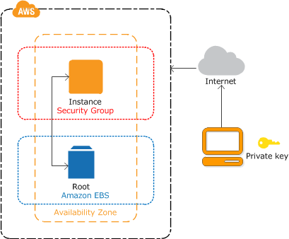
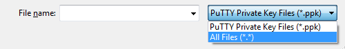

# Amazon Elastic Compute Cloud (EC2) Instances

## What is Amazon EC2?

Amazon Elastic Compute Cloud (Amazon EC2) provides scalable computing capacity in the Amazon Web Services (AWS) cloud. Using Amazon EC2 eliminates your need to invest in hardware up front, so you can develop and deploy applications faster. You can use Amazon EC2 to launch as many or as few virtual servers as you need, configure security and networking, and manage storage. Amazon EC2 enables you to scale up or down to handle changes in requirements or spikes in popularity, reducing your need to forecast traffic. 

If you would like to know more about Cloud Computing from AWS point of view, see [What is Cloud Computing?](https://aws.amazon.com/what-is-cloud-computing/)

## How to get started with Amazon EC2

First, you need to get set up to use Amazon EC2. After you are set up, you are ready to complete the Getting Started tutorial for Amazon EC2. Whenever you need more information about an Amazon EC2 feature, you can read the technical documentation. 

You need to get familiar with the follwoing: 

- [Instances and AMIs](https://docs.aws.amazon.com/AWSEC2/latest/UserGuide/ec2-instances-and-amis.html)
- [Regions and Availability Zones](https://docs.aws.amazon.com/AWSEC2/latest/UserGuide/using-regions-availability-zones.html)
- [Instance types](https://docs.aws.amazon.com/AWSEC2/latest/UserGuide/instance-types.html)
- [Tags](https://docs.aws.amazon.com/AWSEC2/latest/UserGuide/Using_Tags.html)

## Setting up with Amazon EC2

Complete the tasks in this section to get set up for launching an Amazon EC2 instance for the first time:

   1. [Sign up for AWS](#sign-up-for-AWS)

   2. [Create a key pair](#create-a-key-pair)

   3. [Create a security group](#create-a-security-group)


### Sign up for AWS

Please follow the instructions in  **[Setting Up an AWS Account](AWS_Account.md)**.


### Create a key pair

AWS uses public-key cryptography to secure the login information for your instance. A Linux instance has no password; you use a key pair to log in to your instance securely. You specify the name of the key pair when you launch your instance, then provide the private key when you log in using SSH.

If you haven't created a key pair already, you can create one using the Amazon EC2 console. Note that if you plan to launch instances in multiple Regions, you'll need to create a key pair in each Region. For more information about Regions, see [Regions, Availability Zones, and Local Zones](https://docs.aws.amazon.com/AWSEC2/latest/UserGuide/using-regions-availability-zones.html). 

You can create a key pair using one of the following method:


1. Open the Amazon EC2 console at [https://console.aws.amazon.com/ec2/](https://console.aws.amazon.com/ec2/).

2. In the navigation pane, choose **Key Pairs**.

3. Choose **Create key pair**.

4. For **Name**, enter a descriptive name for the key pair. Amazon EC2 associates the public key with the name that you specify as the key name. A key name can include up to 255 ASCII characters. It can’t include leading or trailing spaces.

5. For File format, choose the format in which to save the private key. To save the private key in a format that can be used with OpenSSH, choose **pem**. To save the private key in a format that can be used with PuTTY, choose **ppk**.

6. Choose **Create key pair**.

7. The private key file is automatically downloaded by your browser. The base file name is the name you specified as the name of your key pair, and the file name extension is determined by the file format you chose. Save the private key file in a safe place.

	
		/!\ Important


		This is the only chance for you to save the private key file.
	
	


8. If you will use an SSH client on a macOS or Linux computer to connect to your Linux instance, use the following command to set the permissions of your private key file so that only you can read it.

```sh
chmod 400 my-key-pair.pem
```
If you do not set these permissions, then you cannot connect to your instance using this key pair. For more information, see [Error: Unprotected private key file](https://docs.aws.amazon.com/AWSEC2/latest/UserGuide/TroubleshootingInstancesConnecting.html#troubleshoot-unprotected-key). 


#### Watch it here

<figure class="video_container">
<iframe width="560" height="315" src="https://www.youtube.com/embed/JCh5amM_ibg" frameborder="0" allow="accelerometer; autoplay; encrypted-media; gyroscope; picture-in-picture" allowfullscreen></iframe>
</figure>


### Create a security group

Security groups act as a firewall for associated instances, controlling both inbound and outbound traffic at the instance level. You must add rules to a security group that enable you to connect to your instance from your IP address using SSH. You can also add rules that allow inbound and outbound HTTP and HTTPS access from anywhere. 

Note that if you plan to launch instances in multiple Regions, you'll need to create a security group in each Region. For more information about Regions, see [Regions, Availability Zones, and Local Zones](https://docs.aws.amazon.com/AWSEC2/latest/UserGuide/using-regions-availability-zones.html). 

#### Prerequisites

You'll need the public IPv4 address of your local computer. The security group editor in the Amazon EC2 console can automatically detect the public IPv4 address for you. Alternatively, you can use the search phrase "what is my IP address" in an Internet browser, or use the following service: [Check IP](http://checkip.amazonaws.com/). 

If you are connecting through an Internet service provider (ISP) or from behind a firewall without a static IP address, you need to find out the range of IP addresses used by client computers. 

To create a security group with least privilege

1. Open the Amazon EC2 console at [https://console.aws.amazon.com/ec2/](https://console.aws.amazon.com/ec2/).

2. From the navigation bar, select a Region for the security group. Security groups are specific to a Region, so you should select the same Region in which you created your key pair.

3. In the navigation pane, choose **Security Groups**.

4. Choose **Create security group**.

5. In the **Basic details** section, do the following:

    a. Enter a name for the new security group and a description. Use a name that is easy for you to remember, such as your user name, followed by _SG_, plus the Region name. For example, me_SG_uswest2.

    b. In the **VPC** list, select your default VPC for the Region.


6. In the **Inbound rules** section, create the following rules (choose **Add rule** for each new rule):

    - Choose **HTTP** from the **Type** list, and make sure that **Source** is set to **Anywhere (`0.0.0.0/0`)**.

    - Choose **HTTPS** from the **Type** list, and make sure that **Source** is set to **Anywhere (`0.0.0.0/0`)**.

    - Choose **SSH** from the **Type** list. In the **Source** box, choose **My IP** to automatically populate the field with the public IPv4 address of your local computer. Alternatively, choose **Custom** and specify the public IPv4 address of your computer or network in CIDR notation. To specify an individual IP address in CIDR notation, add the routing suffix `/32`, for example, `203.0.113.25/32`. If your company allocates addresses from a range, specify the entire range, such as `203.0.113.0/24`.

   			/!\ Warning

   			For security reasons, we don't recommend that you allow SSH access from all IPv4 addresses (0.0.0.0/0) 
   			to your instance, except for testing purposes and only for a short time.

7. Choose **Create security group**.


For more information, see [Amazon EC2 security groups for Linux instances](https://docs.aws.amazon.com/AWSEC2/latest/UserGuide/ec2-security-groups.html). 


## Getting started with Amazon EC2 Linux instances

When you sign up for AWS, you can get started with Amazon EC2 using the [AWS Free Tier](https://aws.amazon.comfree/?all-free-tier.sort-by=item.additionalFields.SortRank&all-free-tier.sort-order=asc). If you created your AWS account less than 12 months ago, and have not already exceeded the free tier benefits for Amazon EC2, it will not cost you anything to complete this tutorial, because we help you select options that are within the free tier benefits. Otherwise, you'll incur the standard Amazon EC2 usage fees from the time that you launch the instance until you terminate the instance (which is the final task of this tutorial), even if it remains idle. 

The instance is an Amazon EBS-backed instance (meaning that the root volume is an EBS (Elastic Block Store) volume). You can either specify the Availability Zone in which your instance runs, or let Amazon EC2 select an Availability Zone for you. When you launch your instance, you secure it by specifying a key pair and security group. When you connect to your instance, you must specify the private key of the key pair that you specified when launching your instance.




In ordere to implement the previous configuration, you should proceeed with the following:

1. [Launch an instance](#launch-an-instance)
2. [Connect to your instance](#connect-to-your-instance)
3. [Clean up your instance](#clean-up-your-instance)
4. [Terminate your instance](#terminate-your-instance)
5. [Next Steps](#next-steps)


### Launch an instance


You can launch a Linux instance using the AWS Management Console as described in the following procedure. This tutorial is intended to help you launch your first instance quickly, so it doesn't cover all possible options. For more information about the advanced options, see [Launching an Instance](https://docs.aws.amazon.com/AWSEC2/latest/UserGuide/launching-instance.html). 


To launch an instance

1. Open the Amazon EC2 console at [https://console.aws.amazon.com/ec2/](https://console.aws.amazon.com/ec2/).

2. From the console dashboard, choose **Launch Instance**.

3. The **Choose an Amazon Machine Image (AMI)** page displays a list of basic configurations, called Amazon Machine Images (AMIs), that serve as templates for your instance. Select an HVM version of Amazon Linux 2. Notice that these AMIs are marked "Free tier eligible."

4. On the **Choose an Instance Type** page, you can select the hardware configuration of your instance. Select the `t2.micro` instance type, which is selected by default. The `t2.micro` instance type is eligible for the free tier. In Regions where `t2.micro` is unavailable, you can use a `t3.micro` instance under the free tier. For more information, see [AWS Free Tier](https://aws.amazon.comfree/?all-free-tier.sort-by=item.additionalFields.SortRank&all-free-tier.sort-order=asc).

5. Choose **Review and Launch** to let the wizard complete the other configuration settings for you.

6. On the **Review Instance Launch** page, under **Security Groups**, you'll see that the wizard created and selected a security group for you. You can use this security group, or alternatively you can select the security group that you created when getting set up using the following steps:

   	a. Choose **Edit security groups**.

   	b. On the **Configure Security Group** page, ensure that **Select an existing security group** is selected.

   	c. Select your security group from the list of existing security groups, and then choose **Review and Launch**.

7. On the **Review Instance Launch** page, choose **Launch**.

8. When prompted for a key pair, select **Choose an existing key pair**, then select the key pair that you created when getting set up.
		
		/!\ Warning

		Don't select 'Proceed without a key pair'. 
		If you launch your instance without a key pair, then you 'cannot' connect to it.

	When you are ready, select the acknowledgement check box, and then choose **Launch Instances**.

9. A confirmation page lets you know that your instance is launching. Choose **View Instances** to close the confirmation page and return to the console.

10. On the **Instances** screen, you can view the status of the launch. It takes a short time for an instance to launch. When you launch an instance, its initial state is `pending`. After the instance starts, its state changes to running and it receives a public DNS name. (If the **Public DNS (IPv4)** column is hidden, choose **Show/Hide Columns** (the gear-shaped icon) in the top right corner of the page and then select **Public DNS (IPv4)**.)

11. It can take a few minutes for the instance to be ready so that you can connect to it. Check that your instance has passed its status checks; you can view this information in the **Status Checks** column.


---


### Connect to your instance

There are several ways to connect to your Linux instance. For more information, see [Connect to your Linux instance](#connecting-to-your-EC2-instance).

/!\ **Important**

You can't connect to your instance unless you launched it with a key pair for which you have the `.pem` 
file and you launched it with a security group that allows SSH access from your computer. 
If you can't connect to your instance, see [Troubleshooting connecting to your instance](https://docs.aws.amazon.com/AWSEC2/latest/UserGuide/TroubleshootingInstancesConnecting.html) for assistance. 

---

### Clean up your instance

After you've finished with the instance that you created for this tutorial, you should clean up by terminating the instance. If you want to do more with this instance before you clean up, see [Next steps](#next-steps). 


/!\ **Important** 


**Terminating an instance effectively deletes it; you can't reconnect to an instance after you've terminated it.**

---


### Terminate your instance

If you launched an instance that is not within the [AWS Free Tier](https://aws.amazon.com/free/), you'll stop incurring charges for that instance as soon as the instance status changes to `shutting down` or `terminated`. If you'd like to keep your instance for later, but not incur charges, you can `stop` the instance now and then `start` it again later. For more information, see [Stopping Instances](https://docs.aws.amazon.com/AWSEC2/latest/UserGuide/Stop_Start.html). 


To terminate your instance

1. In the navigation pane, choose **Instances**. In the list of instances, select the instance.

2. Choose **Actions, Instance State, Terminate**.

3. Choose **Yes, Terminate** when prompted for confirmation.

   Amazon EC2 shuts down and terminates your instance. After your instance is terminated, it remains visible on the console for a short while, and then the entry is deleted.


---

### Next Steps

After you start your instance, you might want to try some of the following exercises:

- Learn how to remotely manage your EC2 instance using Run Command. For more information, see [AWS Systems Manager Run Command](https://docs.aws.amazon.com/systems-manager/latest/userguide/execute-remote-commands.html) in the AWS Systems Manager User Guide.

- Configure a CloudWatch alarm to notify you if your usage exceeds the Free Tier. For more information, see [Create a Billing Alarm](https://docs.aws.amazon.com/awsaccountbilling/latest/aboutv2/tracking-free-tier-usage.html) in the AWS Billing and Cost Management User Guide.

---

### Watch it here


## Connecting to your Linux EC2 Instances

Connect to the Linux instances that you launched and transfer files between your local computer and your instance. 


The operating system of your local computer determines the options that you have to connect from your local computer to your Linux instance. 


### Connection options

If your local computer operating system is **Linux or macOS X**, you can connect by using one pf the following:

- [SSH Client](#connecting-to-your-linux-instance-using-an-ssh-client)

- [EC2 Instance Connect](https://docs.aws.amazon.com/AWSEC2/latest/UserGuide/Connect-using-EC2-Instance-Connect.html)
- [AWS Systems Manager Session Manager](https://docs.aws.amazon.com/systems-manager/latest/userguide/session-manager.html)


If your local computer operating system is **Windows**, you can connect by using one pf the following:

- [PuTTY](#connecting-to-your-linux-instance-from-windows-using-putty-or-mobaxterm)
- [SSH Client](#connecting-to-your-linux-instance-using-an-ssh-client)
- [AWS Systems Manager Session Manager](https://docs.aws.amazon.com/systems-manager/latest/userguide/session-manager.html)
- [Windows Subsystem for Linux](https://docs.aws.amazon.com/AWSEC2/latest/UserGuide/WSL.html)

### Connecting to your Linux instance using SSH

After you launch your instance, you can connect to it and use it the way that you'd use a computer sitting in front of you. 

#### Prerequisites

Before you connect to your Linux instance, complete the following prerequisites.

1. Verify that the instance is ready
After you launch an instance, it can take a few minutes for the instance to be ready so that you can connect to it. Check that your instance has passed its status checks. You can view this information in the **Status Checks** column on the **Instances** page. 
2. Verify the general prerequisites for connecting to your instance
Check the [General prerequisites for connecting to your instance](https://docs.aws.amazon.com/AWSEC2/latest/UserGuide/connection-prereqs.html).
3. Install an SSH client on your local computer (either Linux or Windows) as needed
Your local computer might have an SSH client installed by default. You can verify this by typing `ssh` at the command line. If your compute doesn't recognize the command, you can install an SSH client. 

	- Recent versions of Windows Server 2019 and Windows 10 - OpenSSH is included as an installable component. For information, see [OpenSSH in Windows](https://docs.microsoft.com/en-us/windows-server/administration/openssh/openssh_overview).
	- Earlier versions of Windows - Download and install OpenSSH. For more information, see [Win32-OpenSSH](https://github.com/PowerShell/Win32-OpenSSH/wiki).
	- Linux and macOS X - Download and install OpenSSH. For more information, see [Linux-openssh](http://www.openssh.com/).

#### Connect to your Linux instance using an SSH client

Use the following procedure to connect to your Linux instance using an SSH client. If you receive an error while attempting to connect to your instance, see [Troubleshooting connecting to your instance](https://docs.aws.amazon.com/AWSEC2/latest/UserGuide/TroubleshootingInstancesConnecting.html).


To connect to your instance using SSH


1. In a terminal window, use the ssh command to connect to the instance. You specify the path and file name of the private key (`.pem`), the user name for your instance, and the public DNS name or IPv6 address for your instance. For more information about how to find the private key, the user name for your instance, and the DNS name or IPv6 address for an instance, see [Locate the private key](https://docs.aws.amazon.com/AWSEC2/latest/UserGuide/connection-prereqs.html#connection-prereqs-private-key) and [Get information about your instance](https://docs.aws.amazon.com/AWSEC2/latest/UserGuide/connection-prereqs.html#connection-prereqs-get-info-about-instance). To connect to your instance, use one of the following commands. 


	a. (Public DNS) To connect using your instance's public DNS name, enter the following command. 

	

		ssh -i /path/my-key-pair.pem my-instance-user-name@my-instance-public-dns-name	

	b. (IPv6) Alternatively, if your instance has an IPv6 address, to connect using your instance's IPv6 address, enter the following command. 


		ssh -i /path/my-key-pair.pem my-instance-user-name@my-instance-IPv6-address

	You see a response like the following:

		The authenticity of host 'ec2-198-51-100-1.compute-1.amazonaws.com (198-51-100-1)' can't be established.
		ECDSA key fingerprint is l4UB/neBad9tvkgJf1QZWxheQmR59WgrgzEimCG6kZY.
		Are you sure you want to continue connecting (yes/no)?	

2. Enter **yes**. 

	You see a response like the following:

		Warning: Permanently added 'ec2-198-51-100-1.compute-1.amazonaws.com' (ECDSA) to the list of known hosts.


### Connecting to your Linux instance from Windows using PuTTY or MobaXterm

After you launch your instance, you can connect to it and use it the way that you'd use a computer sitting in front of you. 


The following instructions explain how to connect to your instance using PuTTY, and MobaXterm, free SSH client for Windows. If you receive an error while attempting to connect to your instance, see [General prerequisites for connecting to your instance](https://docs.aws.amazon.com/AWSEC2/latest/UserGuide/connection-prereqs.html).


#### Prerequisites


Before you connect to your Linux instance using PuTTY, complete the following prerequisites. 

1. Verify that the instance is ready
After you launch an instance, it can take a few minutes for the instance to be ready so that you can connect to it. Check that your instance has passed its status checks. You can view this information in the **Status Checks** column on the **Instances** page. 

2. Verify the general prerequisites for connecting to your instance
Check the [General prerequisites for connecting to your instance](https://docs.aws.amazon.com/AWSEC2/latest/UserGuide/connection-prereqs.html).

	

3. Install PuTTY on your local computer
Download and install PuTTY from the [PuTTY download page](https://www.chiark.greenend.org.uk/~sgtatham/putty/). If you already have an older version of PuTTY installed, we recommend that you download the latest version. Be sure to install the entire suite.

	

4. Or Install MobaXterm on your local computer
Download and install MobaXterm from the [MobaXterm download page](https://mobaxterm.mobatek.net/download.html).

5. Convert your private key using PuTTYgen
**In case you do not have a `.ppk`**, locate the private key (`.pem` file) for the key pair that you specified when you launched the instance. Convert the `.pem` file to a `.ppk` file for use with PuTTY. For more information, follow the steps in the next subsection.


#### Convert your private key using PuTTYgen

PuTTY does not natively support the private key format for SSH keys. PuTTY provides a tool named PuTTYgen, which converts keys to the required format for PuTTY. You must convert your private key (`.pem` file) into this format (`.ppk` file) as follows in order to connect to your instance using PuTTY.

To convert your private key


1. From the **Start** menu, choose **All Programs, PuTTY, PuTTYgen**.

2. Under **Type of key to generate**, choose **RSA**. If you're using an older version of PuTTYgen, choose **SSH-2 RSA**.

	

3. Choose **Load**. By default, PuTTYgen displays only files with the extension `.ppk`. To locate your `.pem` file, choose the option to display files of all types.
Select all file types

	

4. Select your `.pem` file for the key pair that you specified when you launched your instance and choose **Open**. PuTTYgen displays a notice that the `.pem` file was successfully imported. Choose **OK**.

5. To save the key in the format that PuTTY can use, choose **Save private key**. PuTTYgen displays a warning about saving the key without a passphrase. Choose **Yes**.

    	/!\ Note
    	A passphrase on a private key is an extra layer of protection. 
    	Even if your private key is discovered, it can't be used without the passphrase. 
    	The downside to using a passphrase is that it makes automation harder because human 
    	intervention is needed to log on to an instance, or to copy files to an instance.

6. Specify the same name for the key that you used for the key pair (for example, `my-key-pair`) and choose **Save**. PuTTY automatically adds the `.ppk` file extension.

Your private key is now in the correct format for use with PuTTY. You can now connect to your instance using PuTTY's SSH client. 


#### Connecting to your Linux instance


Use the following procedure to connect to your Linux instance using PuTTY. You need the .ppk file that you created for your private key. For more information, see [Convert your private key using PuTTYgen](#convert-your-private-key-using-puttygen) in the preceding section. If you receive an error while attempting to connect to your instance, see [Troubleshooting Connecting to Your Instance](https://docs.aws.amazon.com/AWSEC2/latest/UserGuide/TroubleshootingInstancesConnecting.html). 


To connect to your instance using PuTTY


1. Start PuTTY (from the **Start** menu, choose **All Programs, PuTTY, PuTTY**).

2. In the **Category pane**, choose **Session** and complete the following fields:

	a. In the **Host Name** box, do one of the following:

       - (Public DNS) To connect using your instance's public DNS name, enter 
        ```my-instance-user-name@my-instance-public-dns-name```.

       - (IPv6) Alternatively, if your instance has an IPv6 address, to connect using your instance's IPv6 address, enter ```my-instance-user-name@my-instance-IPv6-address```.

    For information about how to get the user name for your instance, and the public DNS name or IPv6 address of your instance, see [Get information about your instance](https://docs.aws.amazon.com/AWSEC2/latest/UserGuide/connection-prereqs.html#connection-prereqs-get-info-about-instance).

    b. Ensure that the **Port** value is 22.

    c. Under **Connection type**, select **SSH**.


    


3. (Optional) You can configure PuTTY to automatically send 'keepalive' data at regular intervals to keep the session active. This is useful to avoid disconnecting from your instance due to session inactivity. In the **Category** pane, choose **Connection**, and then enter the required interval in the **Seconds between keepalives** field. For example, if your session disconnects after 10 minutes of inactivity, enter 180 to configure PuTTY to send keepalive data every 3 minutes.

4. In the **Category** pane, expand **Connection**, expand **SSH**, and then choose **Auth**. Complete the following:

    a. Choose **Browse**.

    b. Select the `.ppk` file that you generated for your key pair and choose **Open**.

    c. (Optional) If you plan to start this session again later, you can save the session information for future use. Under **Category**, choose **Session**, enter a name for the session in **Saved Sessions**, and then choose **Save**.

    d. Choose **Open**.

5. If this is the first time you have connected to this instance, PuTTY displays a security alert dialog box that asks whether you trust the host to which you are connecting.

    a. Choose **Yes**. A window opens and you are connected to your instance.
		/!\ Note
    	If you specified a passphrase when you converted your private key to PuTTY's format, 
    	you must provide that passphrase when you log in to the instance. 

If you receive an error while attempting to connect to your instance, see [Troubleshooting Connecting to Your Instance](https://docs.aws.amazon.com/AWSEC2/latest/UserGuide/TroubleshootingInstancesConnecting.html). 


## Getting started with Amazon EC2 Windows Instances

To get started with a Windows instance, see [Getting started with Amazon EC2 Windows instances](https://docs.aws.amazon.com/AWSEC2/latest/WindowsGuide/EC2_GetStarted.html).


### Connecting to your Windows instance

To connect to a Windows instance, see [Connecting to Your Windows Instance](https://docs.aws.amazon.com/AWSEC2/latest/WindowsGuide/connecting_to_windows_instance.html) in the Amazon EC2 User Guide for Windows Instances. 