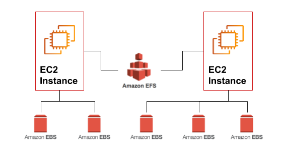

# Amazon EFS volumes

[Amazon Elastic File System (Amazon EFS)](https://aws.amazon.com/efs/) provides **simple, scalable, elastic file storage** for use with AWS Cloud services and on-premises resources. It is straightforward to use, and it offers a simple interface that allows you to create and configure file systems quickly and easily.

Amazon EFS is designed to provide **massively parallel shared access** to **thousands** of Amazon **EC2 instances**. This enables your applications to achieve high levels of aggregate **throughput** and **IOPS** that scale as a file system grows, with consistent **low latencies**.

When an Amazon EFS file system is mounted on Amazon EC2 instances, it provides a standard file system interface and file system access semantics, which allows you to seamlessly integrate Amazon EFS with your existing applications and tools. **Multiple Amazon EC2 instances can access an Amazon EFS file system at the same time**, thus allowing Amazon EFS to provide a _**common data source**_ for workloads and applications that run on **more** than one Amazon EC2 instance.

Current details on Amazon EFS can be found at: [https://aws.amazon.com/efs/](https://aws.amazon.com/efs/).

<iframe width="560" height="315" src="https://www.youtube.com/embed/AvgAozsfCrY" frameborder="0" allow="accelerometer; autoplay; clipboard-write; encrypted-media; gyroscope; picture-in-picture" allowfullscreen></iframe>

## Amazon EFS features

Amazon EFS is well suited to a broad range of use cases, from home directories to business-critical applications. Customers can use Amazon EFS to move NFS-based file storage workloads to managed file systems on the AWS Cloud. Other use cases include:

- analytics, 
- web serving and content management, 
- application development and testing, 
- media and entertainment workflows, 
- database backups, and 
- containers and serverless storage.

EFS has many [features](https://aws.amazon.com/efs/features/), such as:

1. Highly available and durable
2. Storage classes and lifecycle management
3. Security and compliance
4. Scalable performance
5. Elastic and scalable
6. Encryption
7. Fully managed

### Fully Managed feature

Amazon EFS is a fully managed service providing NFS shared file system storage for Linux workloads. Amazon EFS makes it simple to create and configure file systems. You don't have to worry about managing file servers or storage, updating hardware, configuring software, or performing backups. In seconds, you can create a fully managed file system by using the AWS Management Console, the AWS CLI, or an AWS SDK.

### EFS modes and services

EFS has many modes, such as:

1. Performance modes
2. Throughput modes
3. Containers and serverless file storage
4. Data transfer and backup
5. hared file system with NFS v4.0 and v4.1 support

Please check EFS pricing, [https://aws.amazon.com/efs/pricing/](https://aws.amazon.com/efs/pricing/) before start working with it.

## Amazon EBS vs. EFS volumes

Amazon EFS, and Amazon EBS are AWS’ two different block-storage types that can be applicable for different types of workload needs. Let’s take a closer look at the key features of each option, as well as the [similarities and differences](https://www.missioncloud.com/blog/resource-amazon-ebs-vs-efs-vs-s3-picking-the-best-aws-storage-option-for-your-business), see [Amazon EFS FAQs ](https://aws.amazon.com/efs/faq/)

### Similarities and Differences

**Amazon EBS** delivers high-availability block-level storage volumes for Amazon Elastic Compute Cloud (EC2) instances. It stores data on a file system which is retained after the EC2 instance is shut down. 

**Amazon EFS** offers scalable file storage, also optimized for EC2. It can be used as a common data source for any application or workload that runs on numerous instances. Using an EFS file system, you may configure instances to mount the file system. 

**The main differences between EBS and EFS** is that EBS is only accessible from a **single** EC2 instance in your particular AWS region, while EFS allows you to **mount** the file system across **multiple regions and instances**.

So **how can you choose between Amazon EBS vs EFS?** That depends on what benefits you’re looking for, and your use case for your workload. Let’s take an in-depth look at each one to understand their benefits and use cases.

### EBS and EFS Use Cases

#### Amazon EBS

1. Testing and development
2. NoSQL databases
3. Relational databases
4. Business consistency
5. Enterprise-wide applications

#### Amazon EFS

1. Lift-and-shift application support: EFS is elastic, available, and scalable, and enables you to move enterprise applications easily and quickly without needing to re-architect them.

2. Analytics for big data: It has the ability to run big data applications, which demand significant node throughput, low-latency file access, and read-after-write operations.

3. Content management system and web server support: EFS is a robust throughput file system capable of enabling content management systems and web serving applications, such as archives, websites, or blogs.

4. Application development and testing: Only EFS provides a shared file system needed to share code and files, across multiple compute resources to facilitate auto-scaling workloads.

## Getting Started with Amazon Elastic File System: Demo

Here, you can learn how to quickly create an Amazon Elastic File System (Amazon EFS) file system. As part of this process, you mount your file system on an Amazon Elastic Compute Cloud (Amazon EC2) instance in your virtual private cloud (VPC).

### Prerequisites

You need to know the follwoeing:

- You're already familiar with using the Amazon EC2 console to launch instances.

- Your Amazon VPC, Amazon EC2, and Amazon EFS resources are all in the same AWS Region. 

- You can use the default VPC in the AWS Region that you're using for this demonstration.  

### Step 1: Create Your Amazon EFS File System

To create your Amazon EFS file system:

1. Open the Amazon EFS Management Console at [https://console.aws.amazon.com/efs/](https://console.aws.amazon.com/efs/). 

2. Choose **Create file system** to open the **Create file system** dialog box.

3. (Optional) Enter a Name for your file system. 

4. For **Virtual Private Cloud (VPC)**, choose your VPC, or keep it set to your default VPC.  

5. Choose **Create** to create a file system.

6. The File systems page appears with a banner across the top showing the status of the file system you created. A link to access the file system details page appears in the banner when the file system becomes available. 

Check the file system created and its service recommended settings, see [step1](https://docs.aws.amazon.com/efs/latest/ug/gs-step-two-create-efs-resources.html).

### Step 2: Create Your EC2 Resources and Launch Your EC2 Instance 

		/!\ Note
		You can't use Amazon EFS with Microsoft Windows–based Amazon EC2 instances.

To launch the EC2 instance and mount an EFS file system:

1. Launch your EC2 instance as usual, see [Launch Your EC2 Instance](https://docs.aws.amazon.com/efs/latest/ug/gs-step-one-create-ec2-resources.html), please follow the next steps recomendations.

2. In the **Step,Configure Instance Details**, provide the following information:

	a. For **Network**, choose the entry for the same VPC that you noted when you created your EFS file system.

	b. For **Subnet**, choose a default subnet in any Availability Zone.  

	c. For File systems, make sure that the EFS file system that you created in [Step 1: Create Your Amazon EFS File System](EFS.md#step-1-create-your-amazon-efs-file-system) is selected. The path shown next to the file system ID is the mount point that the EC2 instance will use, which you can change. Choose Add to user data to mount the file system when the EC2 is launched.

	d. Under **Advanced Details**, confirm that the user data is present in **User data**.

3. In the **Step, Configure Security Group**, set **Assign a security group** to **Select an existing security group**. Choose the default security group to make sure that it can access your EFS file system. 

4. Finally, Choose **Launch** to start launching your instance.

### Step 3: Mount your  Amazon EFS File System 

After [creating your EFS volume](https://docs.aws.amazon.com/efs/latest/ug/gs-step-two-create-efs-resources.html) and [launcing your EC2 instance(s)](https://docs.aws.amazon.com/efs/latest/ug/gs-step-one-create-ec2-resources.html) either with Linux or Ubuntu AMIs, see [Mounting EFS file systems](https://docs.aws.amazon.com/efs/latest/ug/mounting-fs.html).

Follow the following steps:

1. Connect to your instance(s), see [Connecting to your Linux EC2 Instances](EC2.md#connecting-to-your-linux-ec2-instances).
2. [Mount your file system](https://aws.amazon.com/getting-started/tutorials/create-network-file-system/), by:

	a. Open the [Amazon EFS console](https://console.aws.amazon.com/efs#/get-started) and then select the region where your EFS volume is located.

	b. Select the radio button next to your file system to display the details.

	c. Click the **Attach** button to see the mount instructions link.

	d. Use the **NFS client** or  **EFS mount helper** DNS to mount the EFS volume to your instances.

3. You need to prepare your mounting in your instances, see [Mounting EFS File System](EFSmount.md).

### Step 4: Clean Up Resources and Protect Your AWS Account  

To clean up resources and protect your AWS account, see [Terminate your resources](https://docs.aws.amazon.com/efs/latest/ug/gs-step-five-cleanup.html):

1. Connect to your Amazon EC2 instance.
2. Unmount the Amazon EFS file system with the following command.

		$> sudo umount efs

3. Open the Amazon EFS console at [https://console.aws.amazon.com/efs/](https://console.aws.amazon.com/efs/). 
4. Choose the Amazon EFS file system that you want to delete from the list of file systems. 
5. For **Actions**, choose **Delete file system**.
6. In the **Permanently delete file system** dialog box, type the file system ID for the Amazon EFS file system that you want to delete, and then choose **Delete File System**.  
7. In case you finished with your instance(s), you can **Terminate Instances** and **Delete Security Group** from **Actions**. 

		/!\ Warning
		Don't delete the default security group for your VPC. 