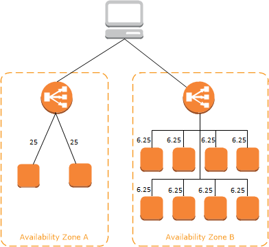

# Load Balancing in AWS

[Elastic Load Balancing (ELB)](https://aws.amazon.com/elasticloadbalancing/) automatically distributes incoming application traffic across multiple targets, such as Amazon EC2 instances, containers, and IP addresses. It can handle the varying load of your application traffic in a single Availability Zone or across multiple Availability Zones. Elastic Load Balancing offers three types of load balancers that all feature the high availability, automatic scaling, and robust security necessary to make your applications fault tolerant.

1. [Application Load Balancer](https://aws.amazon.com//elasticloadbalancing/features/#Details_for_Elastic_Load_Balancing_Products) is best suited for load balancing of HTTP and HTTPS traffic and provides advanced request routing targeted at the delivery of modern application architectures, including microservices and containers. Operating at the individual request level (Layer 7), Application Load Balancer routes traffic to targets within Amazon Virtual Private Cloud (Amazon VPC) based on the content of the request.

2. [Network Load Balancer](https://aws.amazon.com//elasticloadbalancing/features/#Details_for_Elastic_Load_Balancing_Products) is best suited for load balancing of TCP traffic where extreme performance is required. Operating at the connection level (Layer 4), Network Load Balancer routes traffic to targets within Amazon Virtual Private Cloud (Amazon VPC) and is capable of handling millions of requests per second while maintaining ultra-low latencies. Network Load Balancer is also optimized to handle sudden and volatile traffic patterns.

3. [Classic Load Balancer](https://aws.amazon.com//elasticloadbalancing/features/#Details_for_Elastic_Load_Balancing_Products) provides basic load balancing across multiple Amazon EC2 instances and operates at both the request level and connection level. Classic Load Balancer is intended for applications that were built within the EC2-Classic network. 

 For more information, see [Comparison of Elastic Load Balancing products](https://aws.amazon.com/elasticloadbalancing/features/#compare). 

## ELB: Benefits and Use Cases

**ELB Benefits**

- Highly available
- Secure
- Elastic
- Flexible
- Robust monitoring & auditing
- Hybrid load balancing

**ELB Use Cases**

- Achieve better fault tolerance for your applications
- Automatically load balance your containerized applications
- Automatically scale your applications
- Using Elastic Load Balancing in your Amazon Virtual Private Cloud (Amazon VPC)
- Hybrid load balancing with Elastic Load Balancing
- Invoking Lambda functions over HTTP(S)

See, ELB [Features](https://aws.amazon.com/elasticloadbalancing/features/?nc=sn&loc=2) and [Pricing](https://aws.amazon.com/elasticloadbalancing/pricing/?nc=sn&loc=3) before launching your first elastic load balancer on AWS.

 

----------------------------------------------------

## How Elastic Load Balancing works

A load balancer accepts incoming traffic from clients and routes requests to its registered targets (such as EC2 instances) in one or more Availability Zones. The load balancer also monitors the health of its registered targets and ensures that it routes traffic only to healthy targets. When the load balancer detects an unhealthy target, it stops routing traffic to that target. It then resumes routing traffic to that target when it detects that the target is healthy again.

You configure your load balancer to accept incoming traffic by specifying one or more listeners. A listener is a process that checks for connection requests. It is configured with a protocol and port number for connections from clients to the load balancer. Likewise, it is configured with a protocol and port number for connections from the load balancer to the targets.

Elastic Load Balancing supports three types of load balancers:

- Application Load Balancers

- Network Load Balancers

- Classic Load Balancers

There is a key difference in how the load balancer types are configured. With Application Load Balancers and Network Load Balancers, you register targets in target groups, and route traffic to the target groups. With Classic Load Balancers, you register instances with the load balancer. 

### Availability Zones and load balancer nodes

When you enable an Availability Zone for your load balancer, Elastic Load Balancing creates a load balancer node in the Availability Zone. If you register targets in an Availability Zone but do not enable the Availability Zone, these registered targets do not receive traffic. Your load balancer is most effective when you ensure that each enabled Availability Zone has at least one registered target.

We recommend that you enable multiple Availability Zones. (With an Application Load Balancer, we require you to enable multiple Availability Zones.) This configuration helps ensure that the load balancer can continue to route traffic. If one Availability Zone becomes unavailable or has no healthy targets, the load balancer can route traffic to the healthy targets in another Availability Zone.

After you disable an Availability Zone, the targets in that Availability Zone remain registered with the load balancer. However, even though they remain registered, the load balancer does not route traffic to them. 

### Cross-zone load balancing

The nodes for your load balancer distribute requests from clients to registered targets. When cross-zone load balancing is enabled, each load balancer node distributes traffic across the registered targets in all enabled Availability Zones. When cross-zone load balancing is disabled, each load balancer node distributes traffic only across the registered targets in its Availability Zone.

The following diagrams demonstrate the effect of cross-zone load balancing. There are two enabled Availability Zones, with two targets in Availability Zone A and eight targets in Availability Zone B. Clients send requests, and Amazon Route 53 responds to each request with the IP address of one of the load balancer nodes. This distributes traffic such that each load balancer node receives 50% of the traffic from the clients. Each load balancer node distributes its share of the traffic across the registered targets in its scope.

If cross-zone load balancing is enabled, each of the 10 targets receives 10% of the traffic. This is because each load balancer node can route its 50% of the client traffic to all 10 targets. 

If cross-zone load balancing is disabled:

- Each of the two targets in Availability Zone A receives 25% of the traffic.

- Each of the eight targets in Availability Zone B receives 6.25% of the traffic.

This is because each load balancer node can route its 50% of the client traffic only to targets in its Availability Zone.

With Application Load Balancers, cross-zone load balancing is always enabled.

With Network Load Balancers, cross-zone load balancing is disabled by default. After you create a Network Load Balancer, you can enable or disable cross-zone load balancing at any time. For more information, see Cross-zone load balancing in the User Guide for Network Load Balancers.

When you create a Classic Load Balancer, the default for cross-zone load balancing depends on how you create the load balancer. With the API or CLI, cross-zone load balancing is disabled by default. With the AWS Management Console, the option to enable cross-zone load balancing is selected by default. After you create a Classic Load Balancer, you can enable or disable cross-zone load balancing at any time. For more information, see Enable cross-zone load balancing in the User Guide for Classic Load Balancers. 

 

----------------------------------------------------

## Getting started with Elastic Load Balancing

Let's get started by creating a load balancer with the Elastic Load Balancing wizard in the AWS Management Console, a point-and-click web-based interface.

1. Create an account and sign into the console
2. Create a load balancer by selecting Application Load Balancer or Network Load Balancer
3. Specify a unique name and a network
4. Create listeners for your load balancer (HTTP or HTTPS for Application Load Balancer and TCP or UDP for Network Load Balancer)
5. Configure health checks for your load balancer
6. Do one of the following:

- Manually register EC2 instances to your Target Group and register the Target Group with your load balancer
- Associate your load balancer with an Auto Scaling group that is registered to a Target Group

<iframe width="560" height="315" src="https://www.youtube.com/embed/8KQ8aLoxVi0" frameborder="0" allow="accelerometer; autoplay; clipboard-write; encrypted-media; gyroscope; picture-in-picture" allowfullscreen></iframe>

For demos of common load balancer configurations, see [Elastic Load Balancing demos](https://exampleloadbalancer.com/).

 

----------------------------------------------------

### Create an Application Load Balancer

#### AWS Management Console

To create an Application Load Balancer using the AWS Management Console, see [Getting started with Application Load Balancers](https://docs.aws.amazon.com/elasticloadbalancing/latest/application/application-load-balancer-getting-started.html) in the User Guide for Application Load Balancers. You need to do the following:

##### Before you begin

- Decide which two Availability Zones you will use for your EC2 instances. Configure your virtual private cloud (VPC) with at least one public subnet in each of these Availability Zones. These public subnets are used to configure the load balancer. You can launch your EC2 instances in other subnets of these Availability Zones instead.

- Launch at least one EC2 instance in each Availability Zone. Be sure to install a web server, such as Apache or Internet Information Services (IIS), on each EC2 instance. Ensure that the security groups for these instances allow HTTP access on port 80.

##### [Step 1: Select a load balancer type](https://docs.aws.amazon.com/elasticloadbalancing/latest/application/application-load-balancer-getting-started.html#select-load-balancer-type)
##### [Step 2: Configure your load balancer and listener](https://docs.aws.amazon.com/elasticloadbalancing/latest/application/application-load-balancer-getting-started.html#configure-load-balancer-listener)
##### [Step 3: Configure a security group for your load balancer](https://docs.aws.amazon.com/elasticloadbalancing/latest/application/application-load-balancer-getting-started.html#configure-security-groups)
##### [Step 4: Configure your target group](https://docs.aws.amazon.com/elasticloadbalancing/latest/application/application-load-balancer-getting-started.html#configure-target-group)
##### [Step 5: Register targets with your target group](https://docs.aws.amazon.com/elasticloadbalancing/latest/application/application-load-balancer-getting-started.html#add-targets)
##### [Step 6: Create and test your load balancer](https://docs.aws.amazon.com/elasticloadbalancing/latest/application/application-load-balancer-getting-started.html#test-load-balancer)
##### [Step 7: Delete your load balancer (optional)](https://docs.aws.amazon.com/elasticloadbalancing/latest/application/application-load-balancer-getting-started.html#delete-load-balancer)

#### AWS CLI

To create an Application Load Balancer using the [AWS CLI, see Create an Application Load Balancer using the AWS CLI](https://docs.aws.amazon.com/elasticloadbalancing/latest/application/tutorial-application-load-balancer-cli.html) in the User Guide for Application Load Balancers. 

----------------------------------------------------

### Create a Network Load Balancer

#### AWS Management Console

To create a Network Load Balancer using the AWS Management Console, see [Getting started with Network Load Balancers](https://docs.aws.amazon.com/elasticloadbalancing/latest/network/network-load-balancer-getting-started.html) in the User Guide for Network Load Balancers. You need to do the following:

##### Before you begin

- Decide which Availability Zones you will use for your EC2 instances. Configure your virtual private cloud (VPC) with at least one public subnet in each of these Availability Zones. These public subnets are used to configure the load balancer. You can launch your EC2 instances in other subnets of these Availability Zones instead.

- Launch at least one EC2 instance in each Availability Zone. Ensure that the security groups for these instances allow TCP access from clients on the listener port and health check requests from your VPC. For more information, see [Target security groups](https://docs.aws.amazon.com/elasticloadbalancing/latest/network/target-group-register-targets.html#target-security-groups).

##### [Step 1: Choose a load balancer type](https://docs.aws.amazon.com/elasticloadbalancing/latest/network/network-load-balancer-getting-started.html#select-load-balancer-type)
##### [Step 2: Configure your load balancer and listener](https://docs.aws.amazon.com/elasticloadbalancing/latest/network/network-load-balancer-getting-started.html#configure-load-balancer)
##### [Step 3: Configure your target group](https://docs.aws.amazon.com/elasticloadbalancing/latest/network/network-load-balancer-getting-started.html#configure-target-group)
##### [Step 4: Register targets with your target group](https://docs.aws.amazon.com/elasticloadbalancing/latest/network/network-load-balancer-getting-started.html#add-targets)
##### [Step 5: Create and test your load balancer](https://docs.aws.amazon.com/elasticloadbalancing/latest/network/network-load-balancer-getting-started.html#test-load-balancer)
##### [Step 6: Delete your load balancer (optional)](https://docs.aws.amazon.com/elasticloadbalancing/latest/network/network-load-balancer-getting-started.html#delete-load-balancer)

#### AWS CLI

To create a Network Load Balancer using the AWS CLI, see [Create a Network Load Balancer using the AWS CLI](https://docs.aws.amazon.com/elasticloadbalancing/latest/network/network-load-balancer-cli.html) in the User Guide for Network Load Balancers.

----------------------------------------------------

### Create a Classic Load Balancer

To create a Classic Load Balancer using the AWS Management Console, see [Create a Classic Load Balancer](https://docs.aws.amazon.com/elasticloadbalancing/latest/classic/elb-getting-started.html) in the User Guide for Classic Load Balancers. 

## More resources

- [Elastic Load Balancing Documentation](https://docs.aws.amazon.com/elasticloadbalancing/index.html)
- Load Balancers
	- [Application Load Balancers](https://docs.aws.amazon.com/elasticloadbalancing/latest/application/application-load-balancers.html)
	- [Network Load Balancers](https://docs.aws.amazon.com/elasticloadbalancing/latest/network/network-load-balancers.html)
- Listeners
	- [Application Load Balancers](https://docs.aws.amazon.com/elasticloadbalancing/latest/application/load-balancer-listeners.html)
	- [Network Load Balancers](https://docs.aws.amazon.com/elasticloadbalancing/latest/network/load-balancer-listeners.html)
- Target Groups
	- [Application Load Balancers](https://docs.aws.amazon.com/elasticloadbalancing/latest/application/load-balancer-target-groups.html)
	- [Network Load Balancers](https://docs.aws.amazon.com/elasticloadbalancing/latest/network/load-balancer-target-groups.html)

- [Best Practices in Evaluating Elastic Load Balancing](https://aws.amazon.com/articles/best-practices-in-evaluating-elastic-load-balancing/)
