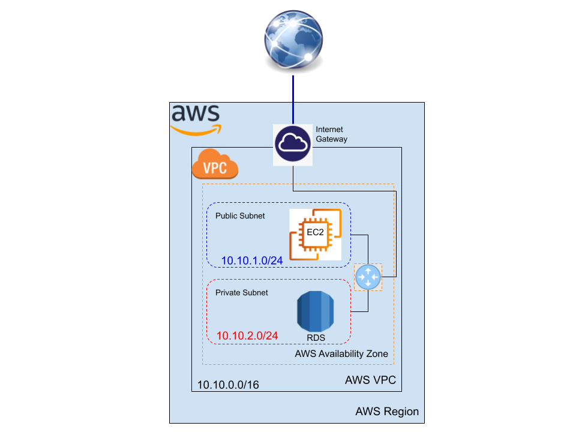
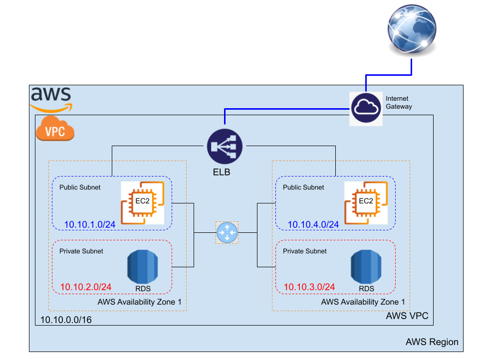
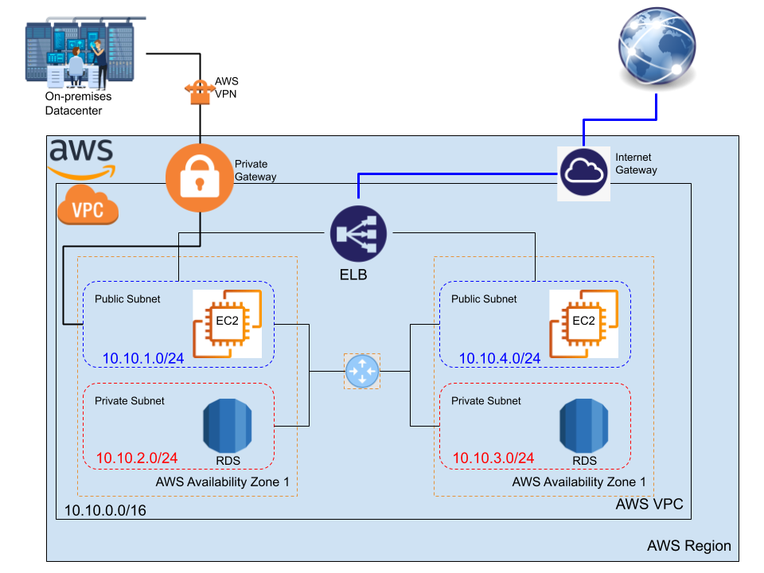

#AWS VPC and Load Balancing Demonistrations

VPC is one of the main components in the AWS network, it helps you create a private network that contains different subnets. These subnets are managed by the routing tables that attached to each subnet and to the default router inside your VPC. 

In these demos, we aim at changing the default subnet, default VPC, and the default route table. Three diffrent tobologies are implemeted on AWS with three cumulative topology, as follow:

1. Demo1: Creating a new VPC with 2 Subnets one public and one private in one availability zone
2. Demo2: Creating a new VPC with 4 Subnets in two availability zones with a load balancer
3. Demo3: Creating a new VPC with 4 Subnets in two availability zones with a private connection to the On-premises datacenter

## Demo 1: Creating a new VPC with 2 Subnets in one availability zone

In this demo, just creating a new VPC with one public subnet and one private subnet. Then adding one Internet gateway to allow the public trafic to the internet. 

### Network Topology

### Step 1: create the VPC and the two supnets

- Follow, [Creating the new VPC with two subnets](vpc.md#working-with-vpcs-and-subnets), to create the VPC, by the following parameters:
	- The VPC address block `10.10.0.0/16`
	- One public subnet `10.10.1.0/24`
	- One private subnet `10.10.2.0/24`

### Step 2: create the Internet Gateway for the public access 

- Follow, [create and configure an interent gateway](vpc.md#adding-an-internet-gateway-to-your-vpc), to craete the IGW, and do the following:
	- Do not forget to deattach the default IGW.
	- Attach the IGW to the VPC
	- Create your route table, see [how to work with route tables](vpc.md#working-with-route-tables)
		- Add the `0.0.0.0/0` the default route to allow public access to your VPC
		- Do the subnets association to this public route table 

### Step 3: launch the EC2 instance 

- Follow, [creating an EC2 inside a subnet](https://docs.aws.amazon.com/vpc/latest/userguide/working-with-vpcs.html#VPC_Launch_Instance)
	- Change the default VPC and default subnet (Availability zone)
	- keep the security group or **configure yours** by adding the `HTTP` rule

### Step 4: assign a public IP for your EC2 instance

- Use the [Elastic IP addresses](https://docs.aws.amazon.com/vpc/latest/userguide/vpc-eips.html#allocate-eip) to create a new public IP and assighn it to your EC2 instance, see:
	- [Allocating an Elastic IP address](https://docs.aws.amazon.com/vpc/latest/userguide/vpc-eips.html#allocate-eip)
	- [Associating an Elastic IP address](https://docs.aws.amazon.com/vpc/latest/userguide/vpc-eips.html#associate-eip)
	- Test your new public IP for the instance by:

			http://your_instance_public_ip/

### Step 5: create your private subnet in the same VPC 

- Follow, [Creating a subnet in your VPC](https://docs.aws.amazon.com/vpc/latest/userguide/working-with-vpcs.html#AddaSubnet) and try to keep it:
	- Private by not associate it to the public route table
	- Create your database inside this subnet

### Watch it here 

<iframe width="560" height="315" src="https://www.youtube.com/embed/w3hw2MjLrC4" frameborder="0" allow="accelerometer; autoplay; clipboard-write; encrypted-media; gyroscope; picture-in-picture" allowfullscreen></iframe>

 

---------------------------------------------------------------

## Demo 2: Creating a new VPC with 4 Subnets in two availability zones with a load balancer

In this demo, we continue on the configuration topology of the first demo, by adding two new subnets one public and one private but in a different availability zone and in the same VPC, then we attach an ELB between the two availability zones to balancing the webservers loads. 

### Network Topology

### Step 1: continue in the same VPC in the previous demo

- Follow, [Creating a subnet in your VPC](https://docs.aws.amazon.com/vpc/latest/userguide/working-with-vpcs.html#AddaSubnet), to create two new subnets, by the following parameters:
	- One public subnet `10.10.3.0/24`
	- One private subnet `10.10.4.0/24`

### Step 2: use the same Internet Gateway for the public access 

- Associate the public subnet to the route table
	- keep the private subnet away from this route table

### Step 3: launch the EC2 instance 

- Follow, [creating an EC2 inside a subnet](https://docs.aws.amazon.com/vpc/latest/userguide/working-with-vpcs.html#VPC_Launch_Instance)
	- Change the default VPC and default subnet (Availability zone)
	- keep the security group or **configure yours** by adding the `HTTP` rule

### Step 4: assign a public IP for your EC2 instance

- Use the [Elastic IP addresses](https://docs.aws.amazon.com/vpc/latest/userguide/vpc-eips.html#allocate-eip) to create a new public IP and assighn it to your EC2 instance, see:
	- [Allocating an Elastic IP address](https://docs.aws.amazon.com/vpc/latest/userguide/vpc-eips.html#allocate-eip)
	- [Associating an Elastic IP address](https://docs.aws.amazon.com/vpc/latest/userguide/vpc-eips.html#associate-eip)
	- Test your new public IP for the instance by:

			http://your_instance_public_ip/

- you can ignore this step by allowing the `Auto-assign Public IP` in the [Step 3: Configure Instance Details](https://docs.aws.amazon.com/AWSEC2/latest/WindowsGuide/launching-instance.html#configure_instance_details_step) while you are launching the EC2 instance

### Step 5: create your private subnet in the same VPC 

- Follow, [Creating a subnet in your VPC](https://docs.aws.amazon.com/vpc/latest/userguide/working-with-vpcs.html#AddaSubnet) and try to keep it:
	- Private by not associate it to the public route table
	- Create your database inside this subnet

### Step 6: create the Elastic Load Balancer (ELB) 

- Follow, [Create an Application Load Balancer](ELB.md#create-an-application-load-balancer), then:
	- Associate the ELB with the 2 EC2 instances
	- Choose your configured VPC
		- Select two availability zones
		- Select the two public subnets
	- Keep the default security configuration
	- Choose a security groupe 
	- In routing targets
		- register the targets,
		- the two instances
	- Review and create, then give it some time 

- Check your ELB after getting `provisioned`,
	- use the public DNS name of the ELB to access your servers

### Watch it here 

<iframe width="560" height="315" src="https://www.youtube.com/embed/l2XxzCOhlQg" frameborder="0" allow="accelerometer; autoplay; clipboard-write; encrypted-media; gyroscope; picture-in-picture" allowfullscreen></iframe>

 

---------------------------------------------------------------

## Demo 3: Creating a new VPC with 4 Subnets with a private connection to the On-premises datacenter

The aim in this demo to connect our private subnets to your on-premises data center through a private gateway. To complete this you need to use the direct connect and VPN AWS services.

### Network Topology

### Step 1: continue in the same VPC in the previous demo

- keep the previous configuration 
	- one VPC
		- 2 public subnets
		- 2 private subnets
	- one ELB
		- Listner: two public subnets
		- Traget: the two instances
	- The Multi-AZ databases are hosted in the two private subnets  

### Step 2: create the private gateway  

- Follow, [Creating a virtual private gateway](https://docs.aws.amazon.com/directconnect/latest/UserGuide/virtualgateways.html#create-virtual-private-gateway), then:
	- Attach it your VPC

### Step 3: create the private route table

- Create your route table, see [how to work with route tables](vpc.md#working-with-route-tables)
	- Add the `172.16.0.0/16` the route to your on-premises datacenter
	- Do the private subnets association to this private route table 

### Step 4: Establish the private connection

- Use [Direct Connect](network2.md#aws-direct-connect) to launch the private connection to your on-premises datacenter

### Step 5: Secure the private connection

- Use [AWS VPN](network2.md#aws-vpn) to secure the private connection to your on-premises datacenter

### Watch it here

<iframe width="560" height="315" src="https://www.youtube.com/embed/X2K3Oig5taA" frameborder="0" allow="accelerometer; autoplay; clipboard-write; encrypted-media; gyroscope; picture-in-picture" allowfullscreen></iframe>

