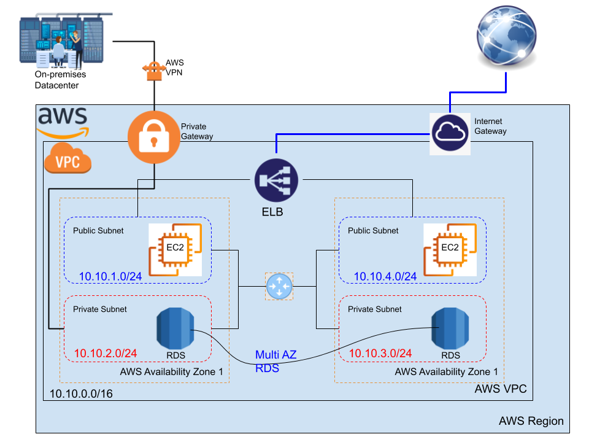

#AWS VPC and Load Balancing Demonistrations

VPC is one of the main components in the AWS network, it helps you create a private network that contains different subnets. These subnets are managed by the routing tables that attached to each subnet and to the default router inside your VPC. 

In these demos, we aim at changing the default subnet, default VPC, and the default route table. Three diffrent tobologies are implemeted on AWS with three cumulative topology, as follow:

1. Demo1: Creating a new VPC with 2 Subnets one public and one private in one availability zone
2. Demo2: Creating a new VPC with 4 Subnets in two availability zones with a load balancer
3. Demo3: Creating a new VPC with 4 Subnets in two availability zones with a private connection to the On-premises datacenter

## Demo 1: Creating a new VPC with 2 Subnets in one availability zone

In this demo, just creating a new VPC with one public subnet and one private subnet. Then adding one Internet gateway to allow the public trafic to the internet. 

### Network Topology

### Step 1: create the VPC and the two supnets

- Follow, [Creating the new VPC with two subnets](vpc.md#working-with-vpcs-and-subnets), to create the VPC, by the following parameters:
	- The VPC address block `10.10.0.0/16`
	- One public subnet `10.10.1.0/24`
	- One private subnet `10.10.2.0/24`

### Step 2: 

### Step 3: 

### Step 4: 

### Step 5: 

### Step 6: 

### Step 7: 

### Step 8:

### Watch it here 

<iframe width="560" height="315" src="https://www.youtube.com/embed/w3hw2MjLrC4" frameborder="0" allow="accelerometer; autoplay; clipboard-write; encrypted-media; gyroscope; picture-in-picture" allowfullscreen></iframe>

 

---------------------------------------------------------------

## Demo 2: Creating a new VPC with 4 Subnets in two availability zones with a load balancer

In this demo, we continue on the configuration topology of the first demo, by adding two new subnets one public and one private but in a different availability zone and in the same VPC, then we attach an ELB between the two availability zones to balancing the webservers loads. 

### Network Topology

### Step 1: create the VPC and the two supnets

- Follow, [Creating the new VPC with two subnets](vpc.md#working-with-vpcs-and-subnets), to create the VPC, by the following parameters:
	- The VPC address block `10.10.0.0/16`
	- One public subnet `10.10.1.0/24`
	- One private subnet `10.10.2.0/24`

### Step 2: 

### Step 3: 

### Step 4: 

### Step 5: 

### Step 6: 

### Step 7: 

### Step 8:

### Watch it here 

<iframe width="560" height="315" src="https://www.youtube.com/embed/l2XxzCOhlQg" frameborder="0" allow="accelerometer; autoplay; clipboard-write; encrypted-media; gyroscope; picture-in-picture" allowfullscreen></iframe>

 

---------------------------------------------------------------

## Demo 3: Creating a new VPC with 4 Subnets with a private connection to the On-premises datacenter

### Network Topology

### 