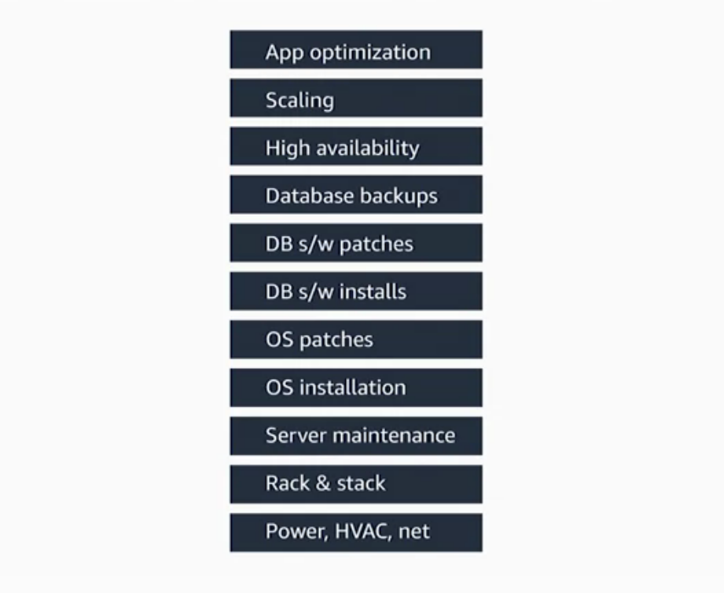
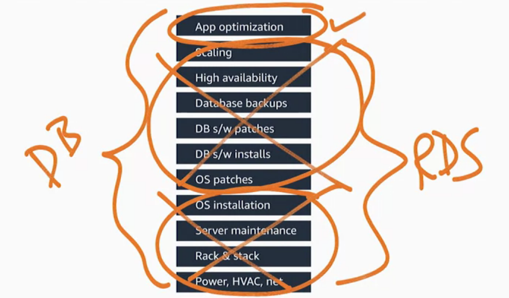

# Databases in AWS

Now, in this section,we're going to discuss how to run relational and NoSQL databases on AWS. We will first look at simply running your own database on top of EC2, much like you would on-premise. Then, we will introduce you to the Amazon Relational Database Service, or RDS. RDS is a managed database service where you can pick amongst popular database engines and let AWS manage your database for you. Next, we will demonstrate Amazon DynamoDB. DynamoDB is a managed NoSQL database that, depending upon
your application, may be a better solution than a traditional SQL-based database. 

## Amazon Relational Database (RDS)

Amazon Relational Database Service (Amazon RDS) makes it straightforward to set up, operate, and scale a relational database in the cloud. It provides cost-efficient and resizable capacity while automating time-consuming administration tasks such as provisioning hardware, setting up the database, patching, and making backups.

Amazon RDS currently supports six database engines:

- Amazon Aurora: [https://aws.amazon.com/rds/aurora/](https://aws.amazon.com/rds/aurora/)
- PostgreSQL: [https://aws.amazon.com/rds/postgresql/](https://aws.amazon.com/rds/postgresql/)
- MySQL: [https://aws.amazon.com/rds/mysql/](https://aws.amazon.com/rds/mysql/)
- MariaDB: [https://aws.amazon.com/rds/mariadb/](https://aws.amazon.com/rds/mariadb/)
- Oracle: [https://aws.amazon.com/rds/oracle/](https://aws.amazon.com/rds/oracle/)
- Microsoft SQL Server: [https://aws.amazon.com/rds/sqlserver/](https://aws.amazon.com/rds/sqlserver/)

## Bring your own database (BYODB) vs Amazon RDS

**Why you should migrate your relational database to Amazon?**

Databases are one of the most important parts of any application. So, **how were databases  before AWS?** 
As we can see on the following chart, there's a whole lot of different functions that exist when running your own database.
So if you were in an on-premises world, ypu would be responsible for everything from power and heating and cooling, racking and stacking the servers, maintaining the servers, so on, all the way up to the application itself.

One of the great things about AWS is by simply moving your database onto EC2, a large section of what you would have to do on-premises, you don't have to worry about in AWS. You don't have to worry about provisioning the hardware as far as racking and
stacking it, maintaining the server. Even installing the operating system is taken care of by simply running your system on EC2.

**What if there was a way to make it even simpler?** 

Introducing the Amazon Relational Database Service, or RDS. At RDS, you still run a relational database of the flavor of your choosing, whether you're talking about a MySQL database, an Oracle database, a PostgreSQL database, or other flavors. But the difference is instead of taking care of the patching and the installs and installing the database itself, **AWS takes care of all of the rest** of the heavy lifting that otherwise your DBA would be in charge of. So no longer does you have to worry about managing the high availability, or managing backups, or taking care of scaling.

But all of these pieces now get taken care of because of the Relational Database Service. And the only thing that your DBA needs to worry about is **taking care of the application itself** se the following chart. So you still are in charge of getting the right schema, getting charge of
the data that's in there, and she is 100% responsible for that. Whether it's encrypted, who has access to it, **AWS has no access to the data**.But all of the rest of the undifferentiated heavy lifting that goes into databases, AWS takes care of.

**Is RDS the perfect solution for everyone?**

You certainly may be in a case where you're using a legacy database. Say you're still running a Sybase shop, you'll still run that on EC2. But as you look for ways to eliminate tasks from your team and let them focus on what they really prepare to do, RDS can certainly get rid of large portions that they don't have to worry about anymore. 

## MySQL in Amazon RDS

## Postgresql in Amazon RDS

## Migrate your Database to AWS Database

You can use the AWS Database Migration Service (AWS DMS) ([https://aws.amazon.com/dms](https://aws.amazon.com/dms)) to quickly and securely migrate your databases to AWS.

