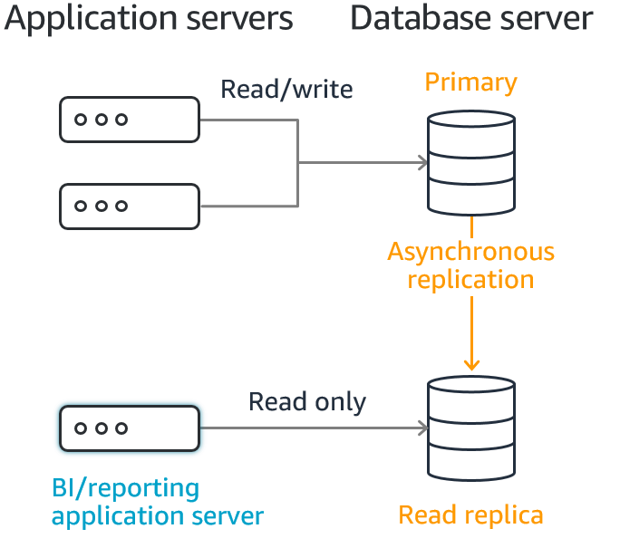

# Databases in AWS

Now, in this section,we're going to discuss how to run relational and NoSQL databases on AWS. We will first look at simply running your own database on top of EC2, much like you would on-premise. Then, we will introduce you to the Amazon Relational Database Service, or RDS. RDS is a managed database service where you can pick amongst popular database engines and let AWS manage your database for you. Next, we will demonstrate Amazon DynamoDB. DynamoDB is a managed NoSQL database that, depending upon
your application, may be a better solution than a traditional SQL-based database. 

## Amazon Relational Database (RDS)

[Amazon Relational Database Service (Amazon RDS)](https://aws.amazon.com/rds/) makes it straightforward to set up, operate, and scale a relational database in the cloud. It provides cost-efficient and resizable capacity while automating time-consuming administration tasks such as provisioning hardware, setting up the database, patching, and making backups.

Amazon RDS currently supports six database engines:

- Amazon Aurora: [https://aws.amazon.com/rds/aurora/](https://aws.amazon.com/rds/aurora/)
- PostgreSQL: [https://aws.amazon.com/rds/postgresql/](https://aws.amazon.com/rds/postgresql/)
- MySQL: [https://aws.amazon.com/rds/mysql/](https://aws.amazon.com/rds/mysql/)
- MariaDB: [https://aws.amazon.com/rds/mariadb/](https://aws.amazon.com/rds/mariadb/)
- Oracle: [https://aws.amazon.com/rds/oracle/](https://aws.amazon.com/rds/oracle/)
- Microsoft SQL Server: [https://aws.amazon.com/rds/sqlserver/](https://aws.amazon.com/rds/sqlserver/)

## Overview of Amazon RDS

Why do you want a managed relational database service? Because Amazon RDS takes over many of the difficult or tedious management tasks of a relational database:

- When you buy a server, you get CPU, memory, storage, and IOPS, all bundled together. With Amazon RDS, these are split apart so that you can scale them independently. If you need more CPU, less IOPS, or more storage, you can easily allocate them.

- Amazon RDS manages backups, software patching, automatic failure detection, and recovery.

- To deliver a managed service experience, Amazon RDS doesn't provide shell access to DB instances. It also restricts access to certain system procedures and tables that require advanced privileges.

- You can have automated backups performed when you need them, or manually create your own backup snapshot. You can use these backups to restore a database. The Amazon RDS restore process works reliably and efficiently.

- You can use the database products you are already familiar with: MySQL, MariaDB, PostgreSQL, Oracle, Microsoft SQL Server.

- You can get high availability with a primary instance and a synchronous secondary instance that you can fail over to when problems occur. You can also use MariaDB, Microsoft SQL Server, MySQL, Oracle, and PostgreSQL read replicas to increase read scaling.

- In addition to the security in your database package, you can help control who can access your RDS databases by using AWS Identity and Access Management (IAM) to define users and permissions. You can also help protect your databases by putting them in a virtual private cloud.

## Bring your own database (BYODB) vs Amazon RDS

**Why you should migrate your relational database to Amazon?**

Databases are one of the most important parts of any application. So, **how were databases  before AWS?** 
As we can see on the following chart, there's a whole lot of different functions that exist when running your own database.
So if you were in an on-premises world, ypu would be responsible for everything from power and heating and cooling, racking and stacking the servers, maintaining the servers, so on, all the way up to the application itself.

One of the great things about AWS is by simply moving your database onto EC2, a large section of what you would have to do on-premises, you don't have to worry about in AWS. You don't have to worry about provisioning the hardware as far as racking and
stacking it, maintaining the server. Even installing the operating system is taken care of by simply running your system on EC2.

**What if there was a way to make it even simpler?** 

Introducing the Amazon Relational Database Service, or RDS. At RDS, you still run a relational database of the flavor of your choosing, whether you're talking about a MySQL database, an Oracle database, a PostgreSQL database, or other flavors. But the difference is instead of taking care of the patching and the installs and installing the database itself, **AWS takes care of all of the rest** of the heavy lifting that otherwise your DBA would be in charge of. So no longer does you have to worry about managing the high availability, or managing backups, or taking care of scaling.

But all of these pieces now get taken care of because of the Relational Database Service. And the only thing that your DBA needs to worry about is **taking care of the application itself** se the following chart. So you still are in charge of getting the right schema, getting charge of
the data that's in there, and she is 100% responsible for that. Whether it's encrypted, who has access to it, **AWS has no access to the data**.But all of the rest of the undifferentiated heavy lifting that goes into databases, AWS takes care of.

**Is RDS the perfect solution for everyone?**

You certainly may be in a case where you're using a legacy database. Say you're still running a Sybase shop, you'll still run that on EC2. But as you look for ways to eliminate tasks from your team and let them focus on what they really prepare to do, RDS can certainly get rid of large portions that they don't have to worry about anymore. 

## Amazon RDS DB instances

A DB instance is an isolated database environment running in the cloud. It is the basic building block of Amazon RDS. A DB instance can contain multiple user-created databases, and can be accessed using the same client tools and applications you might use to access a standalone database instance. DB instances are simple to create and modify with the Amazon AWS command line tools, Amazon RDS API operations, or the AWS Management Console. 

		/!\ Note
		
		- Amazon RDS supports access to databases using any standard SQL client application. 
		- Amazon RDS does not allow direct host access. 

You can have up to 40 Amazon RDS DB instances, with the following limitations:

- 10 for each SQL Server edition (Enterprise, Standard, Web, and Express) under the "license-included" model

- 10 for Oracle under the "license-included" model

- 40 for MySQL, MariaDB, or PostgreSQL

- 40 for Oracle under the "bring-your-own-license" (BYOL) licensing model

Read more about DB instances, see [RDS DB instances](https://docs.aws.amazon.com/AmazonRDS/latest/UserGuide/Overview.DBInstance.html).

### DB instance classes

The DB instance class determines the computation and memory capacity of an Amazon RDS DB instance. The DB instance class you need depends on your processing power and memory requirements. 

Check the following:

- [DB instance class types](https://docs.aws.amazon.com/AmazonRDS/latest/UserGuide/Concepts.DBInstanceClass.html#Concepts.DBInstanceClass.Types)
- [Supported DB engines for DB instance classes](https://docs.aws.amazon.com/AmazonRDS/latest/UserGuide/Concepts.DBInstanceClass.html#Concepts.DBInstanceClass.Support)
- [Changing your DB instance class](https://docs.aws.amazon.com/AmazonRDS/latest/UserGuide/Concepts.DBInstanceClass.html#Concepts.DBInstanceClass.Support)
- [Configuring the processor for a DB instance class](https://docs.aws.amazon.com/AmazonRDS/latest/UserGuide/Concepts.DBInstanceClass.html#USER_ConfigureProcessor)
- [Hardware specifications for DB instance classes](https://docs.aws.amazon.com/AmazonRDS/latest/UserGuide/Concepts.DBInstanceClass.html#Concepts.DBInstanceClass.Summary)

### DB instance storage

DB instances for Amazon RDS for MySQL, MariaDB, PostgreSQL, Oracle, and Microsoft SQL Server use Amazon Elastic Block Store (Amazon EBS) volumes for database and log storage. Depending on the amount of storage requested, Amazon RDS automatically stripes across multiple Amazon EBS volumes to enhance performance. 

**Amazon RDS storage types**

Amazon RDS provides three storage types: 
- General Purpose SSD (also known as gp2), 
- Provisioned IOPS SSD (also known as io1), and 
- magnetic (also known as standard). 

They differ in performance characteristics and price, which means that you can tailor your storage performance and cost to the needs of your database workload. You can create MySQL, MariaDB, Oracle, and PostgreSQL RDS DB instances with up to 64 tebibytes (TiB) of storage. You can create SQL Server RDS DB instances with up to 16 TiB of storage. For this amount of storage, use the Provisioned IOPS SSD and General Purpose SSD storage types. 

## High availability (Multi-AZ) for Amazon RDS

Amazon RDS provides high availability and failover support for DB instances using Multi-AZ deployments. Amazon RDS uses several different technologies to provide failover support. Multi-AZ deployments for MariaDB, MySQL, Oracle, and PostgreSQL DB instances use Amazon's failover technology. SQL Server DB instances use SQL Server Database Mirroring (DBM) or Always On Availability Groups (AGs).

In a Multi-AZ deployment, Amazon RDS **automatically** _provisions_ and _maintains_ a synchronous standby **replica** in a different Availability Zone. The primary DB instance is synchronously replicated across Availability Zones to a standby replica to provide data redundancy, eliminate I/O freezes, and minimize latency spikes during system backups. Running a DB instance with high availability can enhance availability during planned system maintenance, and help protect your databases against DB instance failure and Availability Zone disruption. For more information on Availability Zones, see [Regions, Availability Zones, and Local Zones](https://docs.aws.amazon.com/AmazonRDS/latest/UserGuide/Concepts.RegionsAndAvailabilityZones.html) . 

Using the RDS console, you can create a Multi-AZ deployment by simply specifying Multi-AZ when creating a DB instance. You can use the console to convert existing DB instances to Multi-AZ deployments by modifying the DB instance and specifying the Multi-AZ option.

Check the pricing and billing (per hour) of the RDS in AWS:

- [DB instance billing for Amazon RDS](https://docs.aws.amazon.com/AmazonRDS/latest/UserGuide/User_DBInstanceBilling.html)
- [Amazon RDS for MySQL Pricing](https://aws.amazon.com/rds/mysql/pricing/?nc=sn&loc=4)
- [Amazon RDS for PostgreSQL Pricing](https://aws.amazon.com/rds/postgresql/pricing/)

## Amazon RDS Read Replicas

[Amazon RDS Read Replicas](https://aws.amazon.com/rds/features/read-replicas/) provide enhanced performance and durability for RDS database (DB) instances. They make it easy to elastically scale out beyond the capacity constraints of a single DB instance for read-heavy database workloads. You can create one or more replicas of a given source DB Instance and serve high-volume application read traffic from multiple copies of your data, thereby increasing aggregate read throughput. Read replicas can also be promoted when needed to become standalone DB instances. Read replicas are available in Amazon RDS for MySQL, MariaDB, PostgreSQL, Oracle, and SQL Server as well as Amazon Aurora.

For the MySQL, MariaDB, PostgreSQL, Oracle, and SQL Server database engines, Amazon RDS creates a second DB instance using a snapshot of the source DB instance. It then uses the engines' native asynchronous replication to update the read replica whenever there is a change to the source DB instance. The read replica operates as a DB instance that allows only read-only connections; applications can connect to a read replica just as they would to any DB instance. Amazon RDS replicates all databases in the source DB instance.

[Amazon Aurora](https://aws.amazon.com/rds/aurora/?aurora-whats-new.sort-by=item.additionalFields.postDateTime&aurora-whats-new.sort-order=desc) futher extends the benefits of read replicas by employing an SSD-backed virtualized storage layer purpose-built for database workloads. Amazon Aurora replicas share the same underlying storage as the source instance, lowering costs and avoiding the need to copy data to the replica nodes. For more information about replication with Amazon Aurora, see the [online documentation](https://docs.aws.amazon.com/AmazonRDS/latest/AuroraUserGuide/Aurora.Replication.html).

### Benefits

- Enhanced performance
- Increased availability
- Designed for security

### Setup

Using the AWS Management Console, you can easily add read replicas to existing DB Instances. Use the "Create Read Replica" option corresponding to your DB Instance in the AWS Management Console. Amazon RDS for MySQL, MariaDB, PostgreSQL, Oracle, and SQL Server allow you to add up to 5 read replicas to each DB Instance.

Amazon RDS for MySQL, MariaDB, PostgreSQL, and Oracle offer you two SSD-based choices for database storage: General Purpose and Provisioned IOPS. Read replicas for these engines need not use the same type of storage as their master DB Instances. You may be able to optimize your performance or your spending by selecting an alternate storage type for read replicas. For more information see read replicas documentation for Amazon RDS for MySQL, MariaDB, PostgreSQL, Oracle, and SQL Server as well as Amazon Aurora.

## Databases engines in AWS RDS

In this section, you can review information specific, details, features, and configurations for each of the particular DB engines that is supported in AWS RDS, see the following links:

- [MariaDB on Amazon RDS](https://docs.aws.amazon.com/AmazonRDS/latest/UserGuide/CHAP_MariaDB.html)
- [Microsoft SQL Server on Amazon RDS](https://docs.aws.amazon.com/AmazonRDS/latest/UserGuide/CHAP_SQLServer.html)
- [MySQL on Amazon RDS](https://docs.aws.amazon.com/AmazonRDS/latest/UserGuide/CHAP_MySQL.html)
- [Oracle on Amazon RDS](https://docs.aws.amazon.com/AmazonRDS/latest/UserGuide/CHAP_Oracle.html)
- [PostgreSQL on Amazon RDS](https://docs.aws.amazon.com/AmazonRDS/latest/UserGuide/CHAP_PostgreSQL.html)

## Migrate your Database to AWS Database

You can use the AWS Database Migration Service (AWS DMS) ([https://aws.amazon.com/dms](https://aws.amazon.com/dms)) to quickly and securely migrate your databases to AWS.

