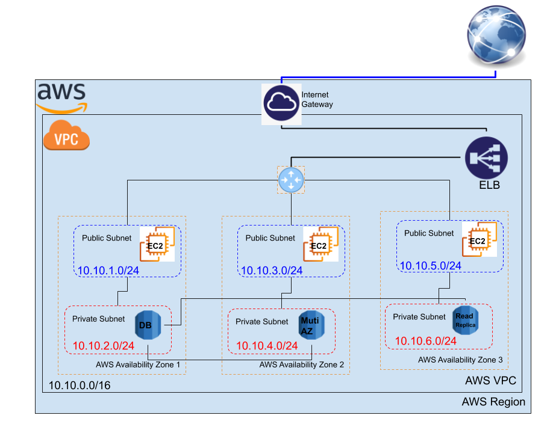

# Getting started with Amazon RDS

## Setting up for Amazon RDS

General configurations you need to do before starting the RDS databases, you should have an AWS account and you already have access to the AWS console, then chack the following:

- [Create an IAM user](https://docs.aws.amazon.com/AmazonRDS/latest/UserGuide/CHAP_SettingUp.html#CHAP_SettingUp.IAM)
- [Determine requirements](https://docs.aws.amazon.com/AmazonRDS/latest/UserGuide/CHAP_SettingUp.html#CHAP_SettingUp.Requirements)
- [Provide access to your DB instance in your VPC by creating a security group ](https://docs.aws.amazon.com/AmazonRDS/latest/UserGuide/CHAP_SettingUp.html#CHAP_SettingUp.SecurityGroup)

 

--------------------------------------------

## Managing Databases in AWS

Before craeting a DB in AWS RDS, you need to decide on:

1. AWS Region
2. Availability Zone (Subnet), local Zone, or Multi AZ
3. DB instance class or type that will run the DB instance

Then you can start **creating, configuring, backing up, restoring, and managing** a database instance.

### Configuring an Amazon RDS DB instance

This section shows how to set up your Amazon RDS DB instance. Before creating a DB instance, decide on the DB instance class that will run the DB instance. Also, decide where the DB instance will run by choosing an AWS Region. Next, create the DB instance. 

- [Creating an Amazon RDS DB instance](https://docs.aws.amazon.com/AmazonRDS/latest/UserGuide/USER_CreateDBInstance.html)
- [Connecting to an Amazon RDS DB instance](https://docs.aws.amazon.com/AmazonRDS/latest/UserGuide/CHAP_CommonTasks.Connect.html)
- [Working with option groups](https://docs.aws.amazon.com/AmazonRDS/latest/UserGuide/USER_WorkingWithOptionGroups.html)
- [Working with DB parameter groups](https://docs.aws.amazon.com/AmazonRDS/latest/UserGuide/USER_WorkingWithParamGroups.html)

### Managing an Amazon RDS DB instance

Following, you can find instructions for managing and maintaining your Amazon RDS DB instance. 

- [Stopping an Amazon RDS DB instance temporarily](https://docs.aws.amazon.com/AmazonRDS/latest/UserGuide/USER_StopInstance.html)
- [Starting an Amazon RDS DB instance that was previously stopped](https://docs.aws.amazon.com/AmazonRDS/latest/UserGuide/USER_StartInstance.html)
- [Modifying an Amazon RDS DB instance](https://docs.aws.amazon.com/AmazonRDS/latest/UserGuide/Overview.DBInstance.Modifying.html)
- [Maintaining a DB instance](https://docs.aws.amazon.com/AmazonRDS/latest/UserGuide/USER_UpgradeDBInstance.Maintenance.html)
- [Upgrading a DB instance engine version](https://docs.aws.amazon.com/AmazonRDS/latest/UserGuide/USER_UpgradeDBInstance.Upgrading.html)
- [Renaming a DB instance](https://docs.aws.amazon.com/AmazonRDS/latest/UserGuide/USER_RenameInstance.html)
- [Rebooting a DB instance](https://docs.aws.amazon.com/AmazonRDS/latest/UserGuide/USER_RebootInstance.html)
- [Working with read replicas](https://docs.aws.amazon.com/AmazonRDS/latest/UserGuide/USER_ReadRepl.html)
- [Tagging Amazon RDS resources](https://docs.aws.amazon.com/AmazonRDS/latest/UserGuide/USER_Tagging.html)
- [Working with Amazon Resource Names (ARNs) in Amazon RDS](https://docs.aws.amazon.com/AmazonRDS/latest/UserGuide/USER_Tagging.ARN.html)
- [Working with storage for Amazon RDS DB instances](https://docs.aws.amazon.com/AmazonRDS/latest/UserGuide/USER_PIOPS.StorageTypes.html)
- [Deleting a DB instance](https://docs.aws.amazon.com/AmazonRDS/latest/UserGuide/USER_DeleteInstance.html)

### Backing up and restoring an Amazon RDS DB instance

This section shows how to back up and restore a DB instance. 

- [Working with backups](https://docs.aws.amazon.com/AmazonRDS/latest/UserGuide/USER_WorkingWithAutomatedBackups.html)
- [Creating a DB snapshot](https://docs.aws.amazon.com/AmazonRDS/latest/UserGuide/USER_CreateSnapshot.html)
- [Restoring from a DB snapshot](https://docs.aws.amazon.com/AmazonRDS/latest/UserGuide/USER_RestoreFromSnapshot.html)
- [Copying a snapshot](https://docs.aws.amazon.com/AmazonRDS/latest/UserGuide/USER_CopySnapshot.html)
- [Sharing a DB snapshot](https://docs.aws.amazon.com/AmazonRDS/latest/UserGuide/USER_ShareSnapshot.html)
- [Exporting DB snapshot data to Amazon S3](https://docs.aws.amazon.com/AmazonRDS/latest/UserGuide/USER_ExportSnapshot.html)
- [Restoring a DB instance to a specified time](https://docs.aws.amazon.com/AmazonRDS/latest/UserGuide/USER_PIT.html)
- [Deleting a snapshot](https://docs.aws.amazon.com/AmazonRDS/latest/UserGuide/USER_DeleteSnapshot.html)
- [Tutorial: Restore a DB instance from a DB snapshot](https://docs.aws.amazon.com/AmazonRDS/latest/UserGuide/CHAP_Tutorials.RestoringFromSnapshot.html)

### Monitoring an Amazon RDS DB instance

This section shows you how to monitor Amazon RDS. 

- [Overview of monitoring Amazon RDS](https://docs.aws.amazon.com/AmazonRDS/latest/UserGuide/MonitoringOverview.html)
- [DB instance status](https://docs.aws.amazon.com/AmazonRDS/latest/UserGuide/Overview.DBInstance.Status.html)
- [Using Amazon RDS recommendations](https://docs.aws.amazon.com/AmazonRDS/latest/UserGuide/USER_Recommendations.html)
- [Enhanced Monitoring](https://docs.aws.amazon.com/AmazonRDS/latest/UserGuide/USER_Monitoring.OS.html)
- [Using Amazon RDS Performance Insights](https://docs.aws.amazon.com/AmazonRDS/latest/UserGuide/USER_PerfInsights.html)
- [Using Amazon RDS event notification](https://docs.aws.amazon.com/AmazonRDS/latest/UserGuide/USER_Events.html)
- [Viewing Amazon RDS events](https://docs.aws.amazon.com/AmazonRDS/latest/UserGuide/USER_ListEvents.html)
- [Getting CloudWatch Events and Amazon EventBridge events for Amazon RDS](https://docs.aws.amazon.com/AmazonRDS/latest/UserGuide/rds-cloud-watch-events.html)
- [Amazon RDS database log files](https://docs.aws.amazon.com/AmazonRDS/latest/UserGuide/USER_LogAccess.html)

 

--------------------------------------------

## Start Working with AWS RDS and DB engines

In this Section, you can strat trying the RDS in AWS with many DB engines, by trying the following:

1. Demos
2. Tutorials
3. Best Practices

### Demos

In the following examples, you can find how to create and connect to a DB instance using Amazon Relational Database Service (Amazon RDS). You can create a DB instance that uses MariaDB, MySQL, Microsoft SQL Server, Oracle, or PostgreSQL. 

Creating a DB instance and connecting to a database on a DB instance is slightly different for each of the DB engines. Choose one of the following DB engines that you want to use for detailed information on creating and connecting to the DB instance. After you have created and connected to your DB instance, there are instructions to help you delete the DB instance.

- [Creating a MariaDB DB instance and connecting to a database on a MariaDB DB instance](https://docs.aws.amazon.com/AmazonRDS/latest/UserGuide/CHAP_GettingStarted.CreatingConnecting.MariaDB.html)
- [Creating a Microsoft SQL Server DB instance and connecting to a DB instance](https://docs.aws.amazon.com/AmazonRDS/latest/UserGuide/CHAP_GettingStarted.CreatingConnecting.SQLServer.html)
- [Creating a MySQL DB instance and connecting to a database on a MySQL DB instance](https://docs.aws.amazon.com/AmazonRDS/latest/UserGuide/CHAP_GettingStarted.CreatingConnecting.MySQL.html)
	- [Create and Connect to a MySQL Database](https://aws.amazon.com/getting-started/hands-on/create-mysql-db/)
	- [How to Install MySQL on Ubuntu 18.04](https://linuxize.com/post/how-to-install-mysql-on-ubuntu-18-04/)
	- [How to Manage & Create MySQL Users, Databases & Tables](https://www.a2hosting.com/kb/developer-corner/mysql/managing-mysql-databases-and-users-from-the-command-line)
- [Creating an Oracle DB instance and connecting to a database on an Oracle DB instance](https://docs.aws.amazon.com/AmazonRDS/latest/UserGuide/CHAP_GettingStarted.CreatingConnecting.Oracle.html)
- [Creating a PostgreSQL DB instance and connecting to a database on a PostgreSQL DB instance](https://docs.aws.amazon.com/AmazonRDS/latest/UserGuide/CHAP_GettingStarted.CreatingConnecting.PostgreSQL.html)
	- [Create and Connect to a PostgreSQL Database](https://aws.amazon.com/getting-started/tutorials/create-connect-postgresql-db/)
	- [How To Install and Use PostgreSQL on Ubuntu 18.04](https://www.digitalocean.com/community/tutorials/how-to-install-and-use-postgresql-on-ubuntu-18-04)
	- [The PostgreSQL Describe Table Statement](https://kb.objectrocket.com/postgresql/the-postgresql-describe-table-statement-853)
	- [How to fix “ERROR: column c.relhasoids does not exist” in Postgres?](https://stackoverflow.com/questions/58461178/how-to-fix-error-column-c-relhasoids-does-not-exist-in-postgres)
- [Tutorial: Create a web server and an Amazon RDS DB instance](https://docs.aws.amazon.com/AmazonRDS/latest/UserGuide/TUT_WebAppWithRDS.html)

#### Troubleshooting for Amazon RDS 

- [Troubleshooting for Amazon RDS](https://docs.aws.amazon.com/AmazonRDS/latest/UserGuide/CHAP_Troubleshooting.html#CHAP_Troubleshooting.Connecting)

### Tutorials

The following tutorials show you how to perform common tasks that use Amazon RDS: 

- [Tutorial: Create an Amazon VPC for use with a DB instance](https://docs.aws.amazon.com/AmazonRDS/latest/UserGuide/CHAP_Tutorials.WebServerDB.CreateVPC.html)

- [Tutorial: Create a web server and an Amazon RDS DB instance](https://docs.aws.amazon.com/AmazonRDS/latest/UserGuide/TUT_WebAppWithRDS.html)

- [Tutorial: Restore a DB instance from a DB snapshot](https://docs.aws.amazon.com/AmazonRDS/latest/UserGuide/CHAP_Tutorials.RestoringFromSnapshot.html)

### Best practices for Amazon RDS

Learn best practices for working with Amazon RDS. As new best practices are identified, we will keep this section up to date. 

- [Amazon RDS basic operational guidelines](https://docs.aws.amazon.com/AmazonRDS/latest/UserGuide/CHAP_BestPractices.html#CHAP_BestPractices.DiskPerformance)
- [DB instance RAM recommendations](https://docs.aws.amazon.com/AmazonRDS/latest/UserGuide/CHAP_BestPractices.html#CHAP_BestPractices.Performance.RAM)
- [Using Enhanced Monitoring to identify operating system issues](https://docs.aws.amazon.com/AmazonRDS/latest/UserGuide/CHAP_BestPractices.html#CHAP_BestPractices.EnhancedMonitoring)
- [Using metrics to identify performance issues](https://docs.aws.amazon.com/AmazonRDS/latest/UserGuide/CHAP_BestPractices.html#CHAP_BestPractices.UsingMetrics)
- [Best practices for working with MySQL storage engines](https://docs.aws.amazon.com/AmazonRDS/latest/UserGuide/CHAP_BestPractices.html#CHAP_BestPractices.MySQLStorage)
- [Best practices for working with MariaDB storage engines](https://docs.aws.amazon.com/AmazonRDS/latest/UserGuide/CHAP_BestPractices.html#CHAP_BestPractices.MariaDB)
- [Best practices for working with Oracle](https://docs.aws.amazon.com/AmazonRDS/latest/UserGuide/CHAP_BestPractices.html#CHAP_BestPractices.Oracle)
- [Best practices for working with PostgreSQL](https://docs.aws.amazon.com/AmazonRDS/latest/UserGuide/CHAP_BestPractices.html#CHAP_BestPractices.PostgreSQL)
- [Best practices for working with SQL Server](https://docs.aws.amazon.com/AmazonRDS/latest/UserGuide/CHAP_BestPractices.html#CHAP_BestPractices.SQLServer)
- [Working with DB parameter groups](https://docs.aws.amazon.com/AmazonRDS/latest/UserGuide/CHAP_BestPractices.html#CHAP_BestPractices.DBParameterGroup)
- [Amazon RDS new features and best practices presentation video](https://docs.aws.amazon.com/AmazonRDS/latest/UserGuide/CHAP_BestPractices.html#CHAP_BestPractices.Presentation)

 

------------------------------------------

## Demo: Create a web server and an Amazon RDS DB instance

### Network Topology

Use the following topology and start playing with EC2 instances and RDS databases:

### Step 1: Create the VPC

1. By using the VPC wizard, create a VPC,
	- by one public and one private subnets
	- use the `10.1.0.0/16` block of addresses
2. Create 4 more subnets:
	- 2 public
	- 2 private
	- give each a different ip address with `/24` prefix
3. Configure the Internet gateway
	- associate the public subnets
	- keep the private subnets in the internal interfaces

Check, [Create an Amazon VPC for use with a DB instance ](https://docs.aws.amazon.com/AmazonRDS/latest/UserGuide/CHAP_Tutorials.WebServerDB.CreateVPC.html#CHAP_Tutorials.WebServerDB.CreateVPC.VPCAndSubnets) for more details.

### Step 2: Configure the VPC security group

From the VPC, or EC2 Dashboards, access the security groups and,

1. Create a VPC security group for a public web server
	- attach it to the created VPC
	- add inbound rules to the security group
		- Type: `SSH`
		- Port: `20`
		- Source: 'custom' or `everywhere`. 
	- add inbound rules to the security group
		- Type: `HTTP`
		- Port: `80`
		- Source: `everywhere`. 

2. Create a VPC security group for a private DB instance
	- attach it to the created VPC
	- add inbound rules to the security group
		- Type: `MySQL/Aurora`
		- Port: allow MySQL traffic on port `3306`
		- Source: the identifier of the `publicsecuritygroup` security group that you created previously. 

### Step 3: Create the Database Instance

1. Create a DB subnet group
	- In the RDS dashboard, choose **Subnet groups**, then
	- Create DB subnet group, as follow:
		- Attach the VPC created
		- Add subnets absed on Availability Zones and Subnets
			- AZ: `a,b,c`
			- subnets: all the private subnets
			- `10.1.0.0/16`, `10.1.2.0/24`, `10.1.4.0/24`, and `10.1.6.0/24`

Check, [Create an Amazon VPC for use with a DB instance ](https://docs.aws.amazon.com/AmazonRDS/latest/UserGuide/CHAP_Tutorials.WebServerDB.CreateVPC.html#CHAP_Tutorials.WebServerDB.CreateVPC.VPCAndSubnets) for more details.

2. Create a `mysql` DB instance
	- From Amazon RDS console, **create database**
	- Master user: `admin`
	- Auto generate a password – Disable the option 
	- In the Connectivity section, open Additional connectivity configuration and set these values: 
		- Virtual private cloud (VPC) – Choose our VPC
		- **Subnet group** – The DB `subnet group` for the VPC
		- **Public access** – `No`
		- Existing VPC security groups – Choose an existing VPC `security group` that is configured for `private` access, 
		- Database port – `3306`
	- Open the Additional configuration section, and enter 'DatabaseName' for Initial database name. Keep the default settings for the other options.
	- Choose **Create** database to create your RDS MySQL DB instance.
	- Wait for the Status of your new DB instance to show as Available. Then choose the DB instance name to show its details.

3. Configure the `Multi AZ` and `Read replica`
	- Once your DB instance become avaulable
		- Modify it and allow the `Multi AZ` option
		- Choose the immediate change to make changes directly
	- From Actions, choose create a `read replica`
		- Create it in the third private subnet
			- `10.1.6.0/24`

Check, [Create a DB instance ](https://docs.aws.amazon.com/AmazonRDS/latest/UserGuide/CHAP_Tutorials.WebServerDB.CreateDBInstance.html) for more details.

### Step 4: Create the EC2 instances and install the web servers

1. Launch three EC2 instances
	- AMI: Ubuntu 16
	- Add the VPC
	- put each instnace in one of the public subnet
	- Enable the auto assigning of IPs
	- Configure Security Group
		- Use the `public security groupe` for each of the instance
	- Review and launch
		- use your favorit key
	- Wait until **Instance Status** for your instance reads as **Running** before continuing. 

2. Install an `Apache` web server with `PHP`
	- Use this [script](https://raw.githubusercontent.com/AbdallahCoptan/HandsOn/master/AWS/docs/Codes/DB.php) to install the web server.

3. Connect the Apache web server to your DB instance
	- edit the [dbinfo](https://raw.githubusercontent.com/AbdallahCoptan/HandsOn/master/AWS/docs/Codes/dbinfo.inc) for connection
		- DB_SERVER: `db_instance_endpoint`
		- DB_USERNAME: `admin`
		- DB_PASSWORD: 'master password'
		- DB_DATABASE: 'database name'
	- Save and close the `dbinfo.inc` file. 

4. Use the php file to test the connection and database
	- [DB.php](https://raw.githubusercontent.com/AbdallahCoptan/HandsOn/master/AWS/docs/Codes/DB.php)
	- use the public IP of each instance to check the database

Check, [Create an EC2 instance: webserver](https://docs.aws.amazon.com/AmazonRDS/latest/UserGuide/CHAP_Tutorials.WebServerDB.CreateWebServer.html) for more details.

### Step 5: Create the application Elastic Load Balancer (ELB

1. Associate the ELB with the 3 EC2 instances
	- Choose your configured VPC
		- Select the three availability zones
		- Select the three public subnets
	- Keep the default security configuration
	- Choose the public security groupe 
	- In routing targets
		- register the targets,
		- the three instances
	- Review and create, then give it some time 

2. Check your ELB after getting `provisioned`,
	- use the public DNS name of the ELB to access your servers

Check, [Getting started with Application Load Balancers](https://docs.aws.amazon.com/elasticloadbalancing/latest/application/application-load-balancer-getting-started.html) for more details

### Watch it here

### References and Help 

Please follow:

- [Using Amazon RDS with Amazon VPC](https://docs.aws.amazon.com/AmazonRDS/latest/UserGuide/USER_VPC.html)
	- [Determining whether you are using the EC2-VPC or EC2-Classic platform](https://docs.aws.amazon.com/AmazonRDS/latest/UserGuide/USER_VPC.FindDefaultVPC.html)
	- [Scenarios for accessing a DB instance in a VPC](https://docs.aws.amazon.com/AmazonRDS/latest/UserGuide/USER_VPC.Scenarios.html)
		- DB In a VPC
			- [An EC2 instance in the same VPC](https://docs.aws.amazon.com/AmazonRDS/latest/UserGuide/USER_VPC.Scenarios.html#USER_VPC.Scenario1)
			- [An EC2 instance in a different VPC](https://docs.aws.amazon.com/AmazonRDS/latest/UserGuide/USER_VPC.Scenarios.html#USER_VPC.Scenario3)
			- [An EC2 instance not in a VPC](https://docs.aws.amazon.com/AmazonRDS/latest/UserGuide/USER_VPC.Scenarios.html#USER_VPC.ClassicLink)
			- [A client application through the internet](https://docs.aws.amazon.com/AmazonRDS/latest/UserGuide/USER_VPC.Scenarios.html#USER_VPC.Scenario4)
		- Not in a VPC
			- [An EC2 instance in a VPC](https://docs.aws.amazon.com/AmazonRDS/latest/UserGuide/USER_VPC.Scenarios.html#USER_VPC.Scenario5)
			- [An EC2 instance not in a VPC](https://docs.aws.amazon.com/AmazonRDS/latest/UserGuide/USER_VPC.Scenarios.html#USER_VPC.Scenario7)
			- [A client application through the internet](https://docs.aws.amazon.com/AmazonRDS/latest/UserGuide/USER_VPC.Scenarios.html#USER_VPC.Scenario6)
	- [Working with a DB instance in a VPC](https://docs.aws.amazon.com/AmazonRDS/latest/UserGuide/USER_VPC.WorkingWithRDSInstanceinaVPC.html)
	- [Tutorial: Create an Amazon VPC for use with a DB instance](https://docs.aws.amazon.com/AmazonRDS/latest/UserGuide/CHAP_Tutorials.WebServerDB.CreateVPC.html)

Then check the following:

- [Create a DB instance](https://docs.aws.amazon.com/AmazonRDS/latest/UserGuide/CHAP_Tutorials.WebServerDB.CreateDBInstance.html)
- [Create an EC2 instance and install a web server](https://docs.aws.amazon.com/AmazonRDS/latest/UserGuide/CHAP_Tutorials.WebServerDB.CreateWebServer.html)

