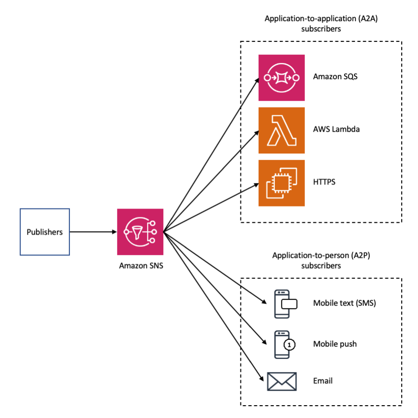

# Amazon Simple Notification Service (Amazon SNS)

Amazon Simple Notification Service (Amazon SNS) is a managed service that provides message delivery from publishers to subscribers (also known as producers and consumers). Publishers communicate asynchronously with subscribers by sending messages to a topic, which is a logical access point and communication channel. Clients can subscribe to the SNS topic and receive published messages using a supported protocol, such as Amazon SQS, AWS Lambda, HTTP, email, mobile push notifications, and mobile text messages (SMS). 

## Features and capabilities

- Application-to-application messaging
- Application-to-person notifications 
- Standard and FIFO topics 
- Message delivery retry 
- Dead-letter queues 
- Message attributes 
- Message filtering 
- Message security 
- Message durability 

## Getting started with Amazon SNS

This section helps you become more familiar with Amazon SNS by showing you how to manage topics, subscriptions, and messages using the Amazon SNS console. 

- [Prerequisites](https://docs.aws.amazon.com/sns/latest/dg/sns-setting-up.html)
- [Step 1: Create a topic](https://docs.aws.amazon.com/sns/latest/dg/sns-getting-started.html#step-create-queue)
- [Step 2: Create a subscription to the topic](https://docs.aws.amazon.com/sns/latest/dg/sns-getting-started.html#step-send-message)
- [Step 3: Publish a message to the topic](https://docs.aws.amazon.com/sns/latest/dg/sns-getting-started.html#step-receive-delete-message)
- [Step 4: Delete the subscription and topic](https://docs.aws.amazon.com/sns/latest/dg/sns-getting-started.html#step-delete-queue)
- [Next steps](https://docs.aws.amazon.com/sns/latest/dg/sns-getting-started.html#sns-next-steps-getting-started)
