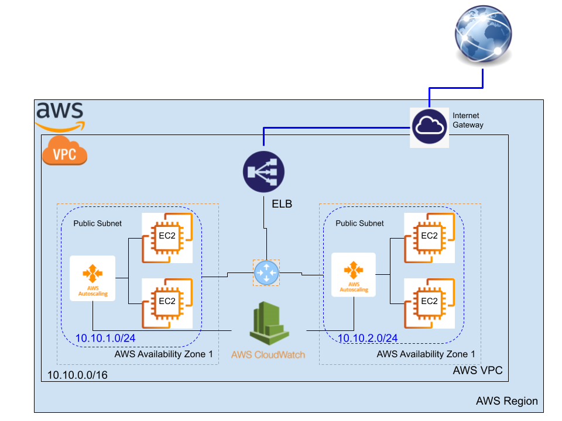

# Demo: Auto-scaling, Load-Balancing, and CloudWatch Alarms

This demo shows how to deal with auto-scaling, balancing your application load, and how to work with the CloadWatch. In CloudWatch, the demo will show how to monitor your instances and make alerts and alarms.

## Network Topology

Use the following topology and start playing with Auto-scaling EC2 instances and CloudWatch monitoring:

## Step 1: Create the VPC

1. By using the VPC wizard, create a VPC,
	- by one public subnets
	- use the `10.10.0.0/16` block of addresses
2. Create one more subnets:
	- 1 public
	- give each a different ip address with `/24` prefix
3. Configure the Internet gateway
	- associate the public subnets

4. Create a VPC security group for a public web server
	- attach it to the created VPC
	- add inbound rules to the security group
		- Type: `SSH`
		- Port: `20`
		- Source: 'custom' or `everywhere`. 
	- add inbound rules to the security group
		- Type: `HTTP`
		- Port: `80`
		- Source: `everywhere`. 

## Step 2: Create the EC2 instances and install the web servers

1. Launch two EC2 instances
	- AMI: Ubuntu 16 
	- Add the VPC
	- put each instnace in one of the public subnet
	- Enable the auto assigning of IPs
	- Configure Security Group
		- Use the `public security groupe` for each of the instance
	- Review and launch
		- use your favorit key
	- Wait until **Instance Status** for your instance reads as **Running** before continuing. 

2. Install an `Apache` web server with `PHP`
	- Use this [script](https://raw.githubusercontent.com/AbdallahCoptan/HandsOn/master/AWS/docs/Codes/AutoscalScript.sh) to install the web server.
 

## Step 3: Create the application Elastic Load Balancer (ELB)

1. Associate the ELB with the 2 EC2 instances
	- Choose your configured VPC
		- Select the two availability zones
		- Select the two public subnets
	- Keep the default security configuration
	- Choose the public security groupe 
	- In routing targets
		- register the targets,
		- the three instances
	- Review and create, then give it some time 

2. Check your ELB after getting `provisioned`,
	- use the public DNS name of the ELB to access your servers

## Step 4: Create and configure the Auto-Scaling 

1. Create the Auto-scaling group
	- Create launch configuration 
		- AMI: `ami-0c6d456c3548469dc`
		- Instance Type: `t2.micro`
		- Choose your Security Group
	- Choose your created `launch configuration`

2. Configure the Auto-Scaling Groupe
	- Group Size : `2`
	- Change VPC and Subnets
	- Select Load balancing
	- Select Traget groups

3. Configure Scaling Policies
	- Min and Max number of instances (Instances adjustment)
	- Average CPU Metric
	- Target value: `60%`
	- Instances Need : `300` seconds to warm up after scaling

## Step 5: Stress the web servers and application

To check the scaling we need to stress the application by:

		$> stress --cpu 8 --io 4 --vm 2 --vm-bytes 128M --timeout 600s

This should be issued in one of the instances or through the [Load.php](https://raw.githubusercontent.com/AbdallahCoptan/HandsOn/master/AWS/docs/Codes/Load.php) script.

## Step 6: Use CloudWatch to monitor the instance Adjustment

1. Go to CloudWatch, and create a board for your instances CPU utilization
	- Monitor their average
	- Once Utilization cross the `60%` 
		- the new two instances will be launched automaticaly
	- Once load minimzed 
		- The new instances will be idel

2. Create more alarms for other metrics and instancces

3. Check your target group in the load balancing

## Watch it here

<iframe width="560" height="315" src="https://www.youtube.com/embed/eV6uLzwS6H0" frameborder="0" allow="accelerometer; autoplay; clipboard-write; encrypted-media; gyroscope; picture-in-picture" allowfullscreen></iframe>

