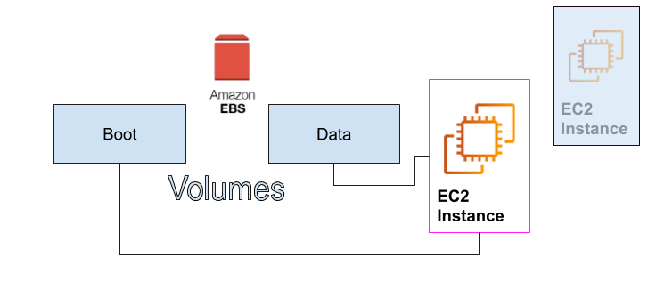
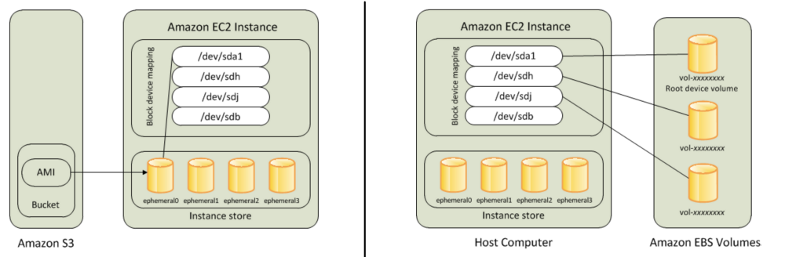

# Amazon EBS Demo

Amazon Elastic Block Store (Amazon EBS) provides **persistent** __block storage__ volumes for use with Amazon EC2 instances in the AWS Cloud. Each Amazon EBS volume is _automatically replicated inside an Availability Zone_ to protect you from component failure, which offers high availability and durability. Amazon EBS volumes offer the **consistent and low-latency performance** that you need to run your workloads.

Amazon EBS provides a range of options that allow you to optimize storage performance and cost for your workload. These options are divided into two major categories:

- Solid State Drive (SSD)-backed storage for transactional workloads, such as 
	- databases and 
	- boot volumes (performance depends primarily on IOPS)

- Hard Disk Drive (HDD)-backed storage for throughput-intensive workloads, such as 
	- MapReduce and 
	- log processing (performance depends primarily on MB/s).

##### Note: EBS types and services quotas

1. Before using the Amazon EBS block storage, you need to check the types of the EBS volumes very carfuly, by checking Amazon [EBS volume types](https://docs.aws.amazon.com/AWSEC2/latest/UserGuide/ebs-volume-types.html).
2. As your account is limited on the number of EBS volumes that you can use, For more information about these limits, see [Amazon EC2 Service Quotas](https://docs.aws.amazon.com/AWSEC2/latest/UserGuide/ec2-resource-limits.html).
3. How to request an increase in your limits, see [Requesting a quota increase](https://docs.aws.amazon.com/servicequotas/latest/userguide/request-quota-increase.html).

The Elastic Volume feature of Amazon EBS allows you to:

- dynamically increase capacity, 
- tune performance, and 
- change the type of live volumes with no downtime or performance impact. 

This allows you to easily right-size your deployment and adapt to performance changes.

Pricing for Amazon EBS is based on the amount (volume) and type of Amazon EBS volume that you provision. For pricing information, see: [https://aws.amazon.com/ebs/pricing/](https://aws.amazon.com/ebs/pricing/). Confirm that you are looking at cost in the correct Region.

Full details on Amazon EBS are available here: [https://aws.amazon.com/ebs](https://aws.amazon.com/ebs) 

## Important feature in Amazone EBS

EBS provides the most common block storage you will use at AWS. When you launch your EC2 instance, you're going to need some kind of block storage to go with it. It's part of the boot volume or maybe it's a separate data volume. AWS has racks of unused storage that you can provision to sizes as large as you need up to many terabytes in size.

When you launch the EC2 instance, the boot volume can attach directly to your EC2 instance, as well as the data volume. **These volumes live independent of the EC2 instance themselves**. In fact, they may already exist before your EC2 instance launches.
When it launches, it simply finds the volume and attaches it the same way you might have an old drive from a laptop.

As in the following image, The EC2 instance, when it connects to the EBS volumes, now has a direct communication to these volumes.
Nobody else can talk directly to them. It's how AWS maintains secure communications at all times.

.png) 

The EBS volumes have a lifecycle independent of EC2. What does this mean? Let's say that this EC2 instance is part of a developer machine that over the weekend, nobody is using because your developers go home over the weekend. So, during those 48 hours, 72 hours,
there's no reason to be paying for EC2 because nobody is using it. All you have to do is simply stop the instance. When you stop EC2,
the EBS volumes survive. They just simply are no longer connected to the EC2 instance. See the following image.

.png)

Then, Monday morning comes around, your developer starts up an EC2 instance, and a brand new instance is created. It reattaches those same EBS volumes the same way you would simply shut down your laptop over the weekend and start it again on Monday. But over the weekend, you didn't have to pay for EC2. But there's more we can take advantage of the idea that EBS lives outside of EC2 because what if I want a more powerful machine? Just like I could take your hard drives out of your existing laptop and put it in a stronger laptop, at AWS, you can simply provision a newer, bigger EC2 instance, stop the old EC2 instance, and then just attach the volumes to your brand new EC2. So, now, I've got the same boot volume, the same applications, the same data only running newer, bigger, stronger. It's one of the many advantages EBS brings to you as part of AWS

## Difference between EBS and Instance Store

EC2 instances support two types for block level storage: 
- EC2 Instances can be launched using either Elastic Block Store (EBS) or 
- Instance Store volume as root volumes and additional volumes.

**EBS volume** is network attached drive which results in slow performance but data is persistent meaning even if you reboot the instance data will be there.

**Instance store** provides temporary block-level storage for your instance. This storage is located on disks that are physically attached to the host computer.

#### Note
EC2 instances can be launched by choosing between **AMIs** backed by EC2 instance store and AMIs backed by EBS. However, AWS recommends use of EBS backed AMIs, because they launch faster and use persistent storage, please see the [AMIs Categories](https://docs.aws.amazon.com/AWSEC2/latest/UserGuide/ComponentsAMIs.html).

For more information, please check [AWS — Difference between EBS and Instance Store](https://medium.com/awesome-cloud/aws-difference-between-ebs-and-instance-store-f030c4407387).

## Demonestrations: Creating an Amazon EBS volume  

You can create an Amazon EBS volumes, by the following three ways:

1. The root storage through launching instance wizard
2. Create a new EBS volume and attached it to a new/old instance
3. Create from a saved snapshot.

### Demo: EBS as a root storage for EC2 instances

### Demo: Create an empty EBS volume and attach it to a running instance

### Demo: Create an EBS volume from a previously created snapshot and attach it to a running instance

### Demo: Attach an EBS volume to a Windows AMI instance