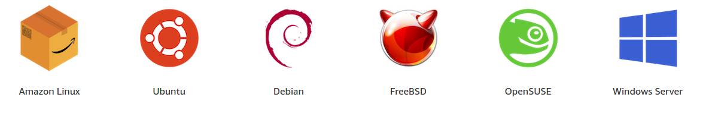
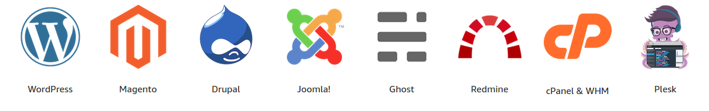
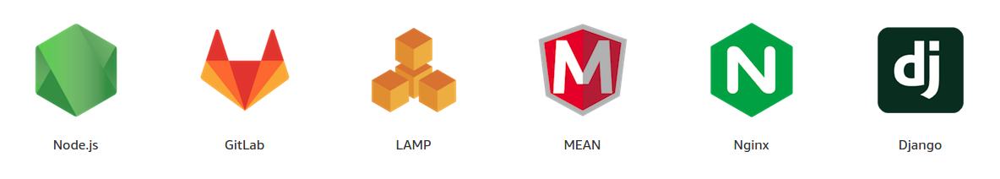

# Amazon Web Services Lightsail

Amazon Lightsail is the easiest way to get started with AWS for developers, small businesses, students, and other users who need a simple virtual private server (VPS) solution. Lightsail provides developers compute, storage, and networking capacity, and it also provides capabilities to deploy and manage websites and web applications in the cloud. Lightsail includes everything you need to launch your project quickly--a virtual machine, solid state drive (SSD)-based storage, data transfer, Domain Name System (DNS) management, and a static IP--for a low, predictable monthly price.

## Lightsail Overview

For more information about [AWS lightsail](https://aws.amazon.com/lightsail/), please check:

- [Lightsail features](https://aws.amazon.com/lightsail/features/)
- [Lightsail pricing](https://aws.amazon.com/lightsail/pricing/) 

## Lightsail Operating system & application templates

Lightsail offers a number of preconfigured, one-click-to-launch application or developer stacks, including WordPress, Plesk, LAMP, Node.js and more. Simple operating systems are also available, including Amazon Linux, Windows Server, Ubuntu, CentOS, and more.

### Operating systems

### Applications

### Stacks

## Lightsail Demonistration

All you have to do is log into your account, and right here on the homepage, you're going to be able to go and build with Lightsail just by clicking on the Lightsail login. 

Now, the nice thing with Lightsail is designed to step you easily through the different pieces that you're going to need without any technical explanation. Please folllow:

1. The first thing that it's going to ask you is what type of application do you want to run on Lightsail? Now, you could run a WordPress application or
maybe get into one of the other more complicated elements.
For example, let's say you want to run a LAMP stack or run a Drupal server.
These become easy choices once you make them. 

2. Decide how big of an engine do you want to run?
Do you want it to have a high volume? High velocity? Or just a nice simple starting one?

3. Got to give it a name.

4. Waita bit, it's already running and we can go ahead and click on that WordPress site. 

5. Use the public IP address, open up a new tab to see the **hello world** example from wordpress.

## Watch more detailed information about Lightsail here

<iframe width="560" height="315" src="https://www.youtube.com/embed/29_LqYnomdg" frameborder="0" allow="accelerometer; autoplay; clipboard-write; encrypted-media; gyroscope; picture-in-picture" allowfullscreen></iframe>