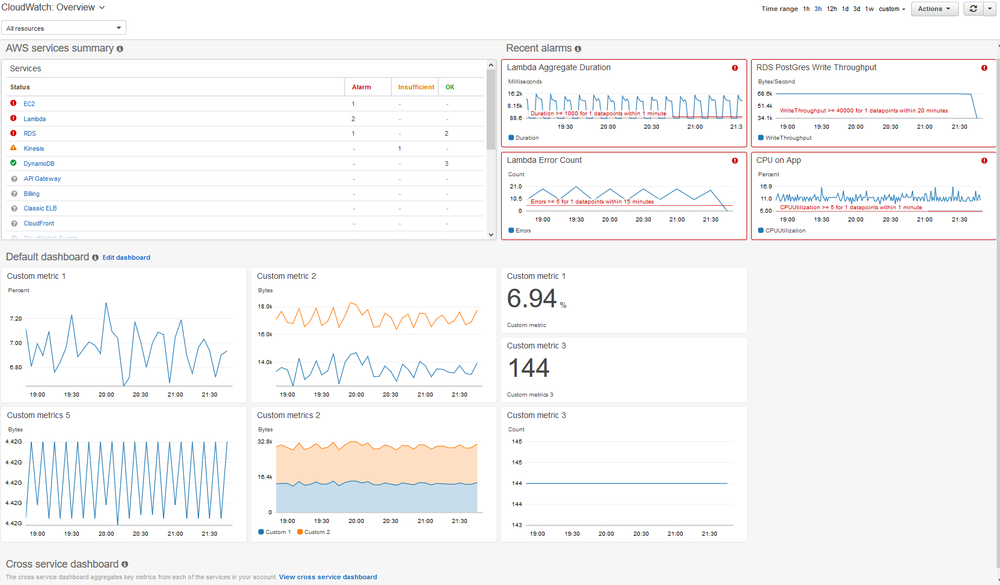

# Monitoring AWS services

Modern applications are distributed in nature, and are often following a service-oriented or microservices architecture. Components of this system will generate data in the form of **metrics, logs, and more**, but all of these data sources are distributed throughout your environment. With any system, to support operations, you have to have **insight** into the current state of the infrastructure and applications.

- You need a way to **collect** these data points and **analyze** them to help **_operate_** daily, and **_improve_** your operations over time.
	- Your network will generate data, like flow logs. 
	- The servers will be generating data, such as how much CPU is currently being used, and 
	- your database layer will generate data, such as number of simultaneous connections.

**How can you collect this data in one centralized location, so you can actively monitor and operate your system?**

With **[Amazon CloudWatch](https://aws.amazon.com/cloudwatch/)**, you can **monitor** your cloud infrastructure intelligently. 

- CloudWatch will collect data from your cloud-based infrastructure in one centralized location.
- With this data, you can create statistics, which drive operational procedures using features such as: 
	- CloudWatch Alarms
	- CloudWatch Events
	- CloudWatch Logs Metrics

-- Let's consider this situation. You get reports from your user base that they're noticing a latency in your services.
Since you now have been made aware of an issue, you can start looking at your system to figure out what the cause of the issue is.
Upon investigation, you realize that the CPU load is around 95 percent across all of your server instances.

-- On-premises, to fix this, you would page an admin, who then launches another server to help bring the load down across the servers. The problem with this approach, manually responding to a problem, is that your users experience interruption before you can mitigate the disruption to your services. **Wouldn't it be nice if we could instead anticipate and mitigate the disruption well before any of our customers are impacted?**

With Amazon CloudWatch, you can configure **metrics** and **alarms** to do just that. 
- CloudWatch collects data points over time and provides you with statistics about your infrastructure. So, you can then create alarms and trigger automated events based on those statistics.

-- Consider our previous example, instead of waiting until hearing about latency from users, instead, you can create an **alarm** that says, if a group of EC2 instances has CPU over 60 percent for more than 5 minutes, trigger an auto scaling policy, automatically launch a new server into the pool, and alert an admin.

-- The visibility into the CPU across EC2 instances, is what allows you to anticipate that your users will soon be experiencing latency if you don't act.

CloudWatch alarms can be configured for more than just CPU utilization. You can choose from hundreds of different metrics, or create your own custom metrics for alarms that matter to you.

In addition to alarms, CloudWatch also allows you to visualize the statistics about your environment through dashboards. 
- You can use out-of-the-box dashboards to view built-in or custom metrics, and 
- you can build your own custom dashboards or partner with a wide range of consultants through the Amazon Partner Network.

-- When building custom metrics, consider the data being generated in your log files. Systems generate different types of log files that have a wealth of information about system performance and error rates.

CloudWatch Logs is a place where; 

- you can send your log files for viewing in the console, and 
- to stream to other services, like Lambda or Amazon Elasticsearch for analytics.

CloudWatch is integrated with over 70 AWS services. You can use CloudWatch to :

- set alarms,
- visualize logs and metrics side-by-side,
- take automated actions, 
- troubleshoot operational issues,
- and discover insights to optimize your applications.

Getting started with CloudWatch is easy and there's no up-front commitment or minimum fee.

For more information, visit [aws.amazon.com/cloudwatch](https://aws.amazon.com/cloudwatch/). 

## Amazon CloudWatch Components

[Amazon CloudWatch](https://aws.amazon.com/cloudwatch/) is a monitoring service for AWS Cloud resources and the applications that you run on AWS. You can use Amazon CloudWatch to collect and track metrics, collect and monitor log files, set alarms, and automatically react to changes in your AWS resources.

### Amazon CloudWatch Events

[Amazon CloudWatch Events](https://docs.aws.amazon.com/AmazonCloudWatch/latest/events/WhatIsCloudWatchEvents.html) delivers a near real-time stream of system events that describe changes in AWS resources. Using simple rules that you can quickly set up, you can match events and route them to one or more target functions or streams. CloudWatch Events becomes aware of operational changes as they occur.

### Amazon CloudWatch Logs Metrics

You can use [Amazon CloudWatch Logs](https://docs.aws.amazon.com/AmazonCloudWatch/latest/logs/WhatIsCloudWatchLogs.html) to monitor, store, and access your log files from Amazon EC2 instances, AWS CloudTrail, Amazon Route 53, and other sources. You can then retrieve the associated log data from CloudWatch Logs.

You can collect [metrics](https://docs.aws.amazon.com/AmazonCloudWatch/latest/monitoring/aws-services-cloudwatch-metrics.html) from servers by installing the CloudWatch agent on the server. You can install the agent on both Amazon EC2 instances and on-premises servers, and on servers that run either Linux or Windows Server.

### Amazon CloudWatch Alarms

You can use [Amazon CloudWatch Alarms](https://docs.aws.amazon.com/AmazonCloudWatch/latest/monitoring/AlarmThatSendsEmail.html) to create alarms which monitor your servcies and track the events when happen to triger the alarms.

There are two alarms in CloudWatch:

- metric alarms, and 
- composite alarms

1. A **etric alarm** watches a single CloudWatch metric or the result of a math expression based on CloudWatch metrics. The alarm performs one or more actions based on the value of the metric or expression relative to a threshold over a number of time periods. The action can be sending a notification to an Amazon SNS topic, performing an Amazon EC2 action or an Auto Scaling action, or creating a Systems Manager OpsItem.

2. A **composite alarm** includes a rule expression that takes into account the alarm states of other alarms that you have created. The composite alarm goes into ALARM state only if all conditions of the rule are met. The alarms specified in a composite alarm's rule expression can include metric alarms and other composite alarms.

Using composite alarms can reduce alarm noise. You can create multiple metric alarms, and also create a composite alarm and set up alerts only for the composite alarm. For example, a composite might go into ALARM state only when all of the underlying metric alarms are in ALARM state.

Composite alarms can send Amazon SNS notifications when they change state, and can create Systems Manager OpsItems when they go into ALARM state, but can't perform EC2 actions or Auto Scaling actions.

-- You can add alarms to CloudWatch dashboards and monitor them visually. When an alarm is on a dashboard, it turns red when it is in the ALARM state, making it easier for you to monitor its status proactively.

-- An alarm invokes actions only when the alarm changes state. The exception is for alarms with Auto Scaling actions. For Auto Scaling actions, the alarm continues to invoke the action once per minute that the alarm remains in the new state. 

		/!\ Note

		CloudWatch doesn't test or validate the actions that you specify, nor does it detect any Amazon EC2 Auto Scaling 
		or Amazon SNS errors resulting from an attempt to invoke nonexistent actions. Make sure that your alarm actions exist.

## Amazon CloudWatch Foundation:  Observability of your AWS resources and applications on AWS and on-premises 

Amazon CloudWatch is a monitoring and observability service built for DevOps engineers, developers, site reliability engineers (SREs), and IT managers. CloudWatch provides you with data and actionable insights to monitor your applications, respond to system-wide performance changes, optimize resource utilization, and get a unified view of operational health. CloudWatch collects monitoring and operational data in the form of logs, metrics, and events, providing you with a unified view of AWS resources, applications, and services that run on AWS and on-premises servers. You can use CloudWatch to detect anomalous behavior in your environments, set alarms, visualize logs and metrics side by side, take automated actions, troubleshoot issues, and discover insights to keep your applications
running smoothly.

<iframe width="560" height="315" src="https://www.youtube.com/embed/a4dhoTQCyRA" frameborder="0" allow="accelerometer; autoplay; clipboard-write; encrypted-media; gyroscope; picture-in-picture" allowfullscreen></iframe>

 

--------------------------------------

### CloudWatch Benefits

1. Observability on a single platform across applications and infrastructure
2. Easiest way to collect metrics in AWS and on-premises
3. Improve operational performance and resource optimization
4. Get operational visibility and insight
5. Derive actionable insights from logs

### CloudWatch Use cases

1. Infrastructure monitoring and troubleshooting
2. Mean-time-to-resolution improvement
3. Proactive resource optimization
4. Application monitoring
5. Log analytics

###  How CloudWatch works?

CloudWatch collects monitoring and operational data in the form of logs, metrics, and events, and visualizes it using automated dashboards so you can get a unified view of your AWS resources, applications, and services that run in AWS and on-premises. You can correlate your metrics and logs to better understand the health and performance of your resources. You can also create alarms based on metric value thresholds you specify, or that can watch for anomalous metric behavior based on machine learning algorithms. To take action quickly, you can set up automated actions to notify you if an alarm is triggered and automatically start auto scaling, for example, to help reduce mean-time-to-resolution. You can also dive deep and analyze your metrics, logs, and traces, to better understand how to improve application performance.

## Amazon CloudWatch Features

Amazon CloudWatch is a monitoring and management service that provides data and actionable insights for AWS, hybrid, and on-premises applications and infrastructure resources. With CloudWatch, you can collect and access all your performance and operational data in form of logs and metrics from a single platform. This allows you to overcome the challenge of monitoring individual systems and applications in silos (server, network, database, etc.). CloudWatch enables you to monitor your complete stack (applications, infrastructure, and services) and leverage alarms, logs, and events data to take automated actions and reduce Mean Time to Resolution (MTTR). This frees up important resources and allows you to focus on building applications and business value.

CloudWatch gives you actionable insights that help you optimize application performance, manage resource utilization, and understand system-wide operational health. CloudWatch provides up to 1-second visibility of metrics and logs data, 15 months of data retention (metrics), and the ability to perform calculations on metrics. This allows you to perform historical analysis for cost optimization and derive real-time insights into optimizing applications and infrastructure resources.

You can use CloudWatch Container Insights to monitor, troubleshoot, and alarm on your containerized applications and microservices. CloudWatch collects, aggregates, and summarizes compute utilization information like CPU, memory, disk, and network data, as well as diagnostic information like container restart failures, to help DevOps engineers isolate issues and resolve them quickly. Container Insights gives you insights from container management services such as Amazon ECS for Kubernetes (EKS), Amazon’s Elastic Container Service (ECS), AWS Fargate, and standalone Kubernetes (k8s).

### Feature 1. Collect

1. Easily collect and store logs
2. Built-in metrics
3. Custom Metrics
4. Collect and aggregate container metrics and logs
5. Collect and aggregate Lambda metrics and logs

### Feature 2. Monitor

1. Unified operational view with dashboards
2. High resolution alarms
3. Logs and metrics correlation
4. Application Insights for .NET and SQL Server applications
5. Container monitoring insights
6. Lambda monitoring insights
7. Anomaly Detection
8. ServiceLens
9. Synthetics

### Feature 3. Act

1. Auto Scaling
2. Automate response to operational changes with CloudWatch Events
3. Alarm and automate actions on EKS, ECS, and k8s clusters

### Feature 4. Analyze

1. Granular data and extended retention
2. Custom operations on metrics
3. Log analytics
4. Analyze container metrics, logs, and traces
5. Analyze Lambda metrics, logs, and traces
6. Contributor Insights

###  Compliance and Security

Amazon CloudWatch is integrated with [AWS Identity and Access Management (IAM)](https://aws.amazon.com/iam/) so that you can control which users and resources have permission to access your data and how they can access it.

Amazon CloudWatch Logs is also PCI and FedRamp compliant. Data is encrypted at rest and during transfer. You can also use AWS KMS encryption to encrypt your log groups for added compliance and security.

### Amazon [CloudWatch pricing](https://aws.amazon.com/cloudwatch/pricing/)

With Amazon CloudWatch, there is no up-front commitment or minimum fee; you simply pay for what you use. You will be charged at the end of the month for your usage.

####  Free tier

You can get started with Amazon CloudWatch for free. Most AWS Services (EC2, S3, Kinesis, etc.) vend metrics automatically for free to CloudWatch. Many applications should be able to operate within these free tier limits. You can learn more about AWS Free Tier [here](https://aws.amazon.com/free/).

|        CloudWatch        	|                                                                                                AWS Free Tier                                                                                               	|
|:------------------------:	|:----------------------------------------------------------------------------------------------------------------------------------------------------------------------------------------------------------:	|
|          Metrics         	| Basic Monitoring Metrics (at 5-minute frequency)   10 Detailed Monitoring Metrics (at 1-minute frequency)    1 Million API requests (not applicable to GetMetricData and GetMetricWidgetImage) 	|
|         Dashboard        	|                                                                                3 Dashboards for up to 50 metrics per month                                                                              	|
|          Alarms          	|                                                                        10 Alarm metrics (not applicable to high-resolution alarms)                                                                      	|
|           Logs           	|                                                             5GB Data (ingestion, archive storage, and data scanned by Logs Insights queries)                                                            	|
|          Events          	|                                                                               All events except custom events are included                                                                              	|
| Contributor  Insights 	|                                                 1 Contributor Insights rule per month   The first one million log events that match the rule per month                                                	|
| Synthetics               	|                                                                                         100 canary runs per month                                                                                       	|

####  Paid tier

There is no up-front commitment or minimum fee. You simply pay for what you use and will be charged at the end of the month for your usage.

Check the AWS CloudWatch prices from [here](https://aws.amazon.com/cloudwatch/pricing/).

 

--------------------------------------------------

## Getting started with Amazon CloudWatch

Open the CloudWatch console at [https://console.aws.amazon.com/cloudwatch/](https://console.aws.amazon.com/cloudwatch/).

The CloudWatch overview home page appears.

See, [Getting Started with Amazon CloudWatch](https://docs.aws.amazon.com/AmazonCloudWatch/latest/monitoring/GettingStarted.html)

### Chech how to get started 

1. [Getting started with Amazon CloudWatch](https://aws.amazon.com/cloudwatch/getting-started/)
2. [Getting Started with Amazon CloudWatch Events](https://docs.aws.amazon.com/AmazonCloudWatch/latest/events/CWE_GettingStarted.html)
3. [Getting Started with CloudWatch Logs](https://docs.aws.amazon.com/AmazonCloudWatch/latest/logs/CWL_GettingStarted.html)

### Check how to use CloudWach Components

1. [Using Amazon CloudWatch Dashboards](https://docs.aws.amazon.com/AmazonCloudWatch/latest/monitoring/CloudWatch_Dashboards.html)
2. [Using Amazon CloudWatch Metrics](https://docs.aws.amazon.com/AmazonCloudWatch/latest/monitoring/working_with_metrics.html)
3. [Using Amazon CloudWatch Alarms](https://docs.aws.amazon.com/AmazonCloudWatch/latest/monitoring/AlarmThatSendsEmail.html)
5. [Using synthetic monitoring](https://docs.aws.amazon.com/AmazonCloudWatch/latest/monitoring/CloudWatch_Synthetics_Canaries.html)

### Check Tutorials

1. [CloudWatch Events Tutorials](https://docs.aws.amazon.com/AmazonCloudWatch/latest/events/CloudWatch-Events-Tutorials.html)
2. [Analyzing Log Data with CloudWatch Logs Insights](https://docs.aws.amazon.com/AmazonCloudWatch/latest/logs/AnalyzingLogData.html)
3. CloudWatch Tutorials:
	- [Scenario: Monitor Your Estimated Charges Using CloudWatch](https://docs.aws.amazon.com/AmazonCloudWatch/latest/monitoring/gs_monitor_estimated_charges_with_cloudwatch.html)

	- [Scenario: Publish Metrics to CloudWatch](https://docs.aws.amazon.com/AmazonCloudWatch/latest/monitoring/PublishMetrics.htmls)

### Check the services Monitoring

- [Monitoring Amazon EC2](https://docs.aws.amazon.com/AWSEC2/latest/UserGuide/monitoring_ec2.html)
- [Amazon EBS volume performance on Linux instances](https://docs.aws.amazon.com/AWSEC2/latest/UserGuide/EBSPerformance.html)
- [Monitoring Amazon EFS](https://docs.aws.amazon.com/efs/latest/ug/monitoring_overview.html)
- [Monitoring Amazon S3](https://docs.aws.amazon.com/AmazonS3/latest/dev/monitoring-overview.html)
- [Monitoring an Amazon RDS DB instance](https://docs.aws.amazon.com/AmazonRDS/latest/UserGuide/CHAP_Monitoring.html)
- [Using Container Insights](https://docs.aws.amazon.com/AmazonCloudWatch/latest/monitoring/ContainerInsights.html)
- [Getting started with Lambda Insights](https://docs.aws.amazon.com/AmazonCloudWatch/latest/monitoring/Lambda-Insights-Getting-Started.html)

