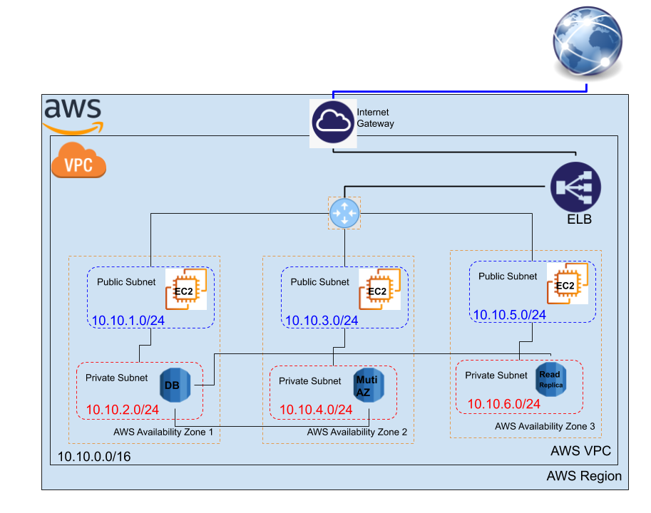

# Demo: Create a web server and an Amazon RDS DB instance

In this demo, we create one VPC that has three public subnets and three private subnets. Each of the public subnets has an EC2 instance with a webserver. The first private subnet has the DB instance and the other two have its read replica and the Multi-AZ. All these configurations and traffic are guided through an elastic load balancer to the internet. see teh demo topology in the following figure.

## Network Topology

Use the following topology and start playing with EC2 instances and RDS databases:

## Step 1: Create the VPC

1. By using the VPC wizard, create a VPC,
	- by one public and one private subnets
	- use the `10.10.0.0/16` block of addresses
2. Create 4 more subnets:
	- 2 public
	- 2 private
	- give each a different ip address with `/24` prefix
3. Configure the Internet gateway
	- associate the public subnets
	- keep the private subnets in the internal interfaces

Check, [Create an Amazon VPC for use with a DB instance ](https://docs.aws.amazon.com/AmazonRDS/latest/UserGuide/CHAP_Tutorials.WebServerDB.CreateVPC.html#CHAP_Tutorials.WebServerDB.CreateVPC.VPCAndSubnets) for more details.

## Step 2: Configure the VPC security group

From the VPC, or EC2 Dashboards, access the security groups and,

1. Create a VPC security group for a public web server
	- attach it to the created VPC
	- add inbound rules to the security group
		- Type: `SSH`
		- Port: `20`
		- Source: 'custom' or `everywhere`. 
	- add inbound rules to the security group
		- Type: `HTTP`
		- Port: `80`
		- Source: `everywhere`. 

2. Create a VPC security group for a private DB instance
	- attach it to the created VPC
	- add inbound rules to the security group
		- Type: `MySQL/Aurora`
		- Port: allow MySQL traffic on port `3306`
		- Source: the identifier of the `publicsecuritygroup` security group that you created previously. 

## Step 3: Create the Database Instance

1. Create a DB subnet group
	- In the RDS dashboard, choose **Subnet groups**, then
	- Create DB subnet group, as follow:
		- Attach the VPC created
		- Add subnets absed on Availability Zones and Subnets
			- AZ: `a,b,c`
			- subnets: all the private subnets
			- `10.10.0.0/16`, `10.10.2.0/24`, `10.10.4.0/24`, and `10.10.6.0/24`

Check, [Create an Amazon VPC for use with a DB instance ](https://docs.aws.amazon.com/AmazonRDS/latest/UserGuide/CHAP_Tutorials.WebServerDB.CreateVPC.html#CHAP_Tutorials.WebServerDB.CreateVPC.VPCAndSubnets) for more details.

2. Create a `mysql` DB instance
	- From Amazon RDS console, **create database**
	- Master user: `admin`
	- Auto generate a password – Disable the option 
	- In the Connectivity section, open Additional connectivity configuration and set these values: 
		- Virtual private cloud (VPC) – Choose our VPC
		- **Subnet group** – The DB `subnet group` for the VPC
		- **Public access** – `No`
		- Existing VPC security groups – Choose an existing VPC `security group` that is configured for `private` access, 
		- Database port – `3306`
	- Open the Additional configuration section, and enter 'DatabaseName' for Initial database name. Keep the default settings for the other options.
	- Choose **Create** database to create your RDS MySQL DB instance.
	- Wait for the Status of your new DB instance to show as Available. Then choose the DB instance name to show its details.

3. Configure the `Multi AZ` and `Read replica`
	- Once your DB instance become avaulable
		- Modify it and allow the `Multi AZ` option
		- Choose the immediate change to make changes directly
	- From Actions, choose create a `read replica`
		- Create it in the third private subnet
			- `10.10.6.0/24`

Check, [Create a DB instance ](https://docs.aws.amazon.com/AmazonRDS/latest/UserGuide/CHAP_Tutorials.WebServerDB.CreateDBInstance.html) for more details.

## Step 4: Create the EC2 instances and install the web servers

1. Launch three EC2 instances
	- AMI: Ubuntu 16
	- Add the VPC
	- put each instnace in one of the public subnet
	- Enable the auto assigning of IPs
	- Configure Security Group
		- Use the `public security groupe` for each of the instance
	- Review and launch
		- use your favorit key
	- Wait until **Instance Status** for your instance reads as **Running** before continuing. 

2. Install an `Apache` web server with `PHP`
	- Use this [script](https://raw.githubusercontent.com/AbdallahCoptan/HandsOn/master/AWS/docs/Codes/DBtest.sh) to install the web server.

3. Connect the Apache web server to your DB instance
	- edit the [dbinfo](https://raw.githubusercontent.com/AbdallahCoptan/HandsOn/master/AWS/docs/Codes/dbinfo.inc) for connection
		- DB_SERVER: `db_instance_endpoint`
		- DB_USERNAME: `admin`
		- DB_PASSWORD: 'master password'
		- DB_DATABASE: 'database name'
	- Save and close the `dbinfo.inc` file. 

4. Use the php file to test the connection and database
	- [DB.php](https://raw.githubusercontent.com/AbdallahCoptan/HandsOn/master/AWS/docs/Codes/DB.php)
	- use the public IP of each instance to check the database

Check, [Create an EC2 instance: webserver](https://docs.aws.amazon.com/AmazonRDS/latest/UserGuide/CHAP_Tutorials.WebServerDB.CreateWebServer.html) for more details.

## Step 5: Create the application Elastic Load Balancer (ELB)

1. Associate the ELB with the 3 EC2 instances
	- Choose your configured VPC
		- Select the three availability zones
		- Select the three public subnets
	- Keep the default security configuration
	- Choose the public security groupe 
	- In routing targets
		- register the targets,
		- the three instances
	- Review and create, then give it some time 

2. Check your ELB after getting `provisioned`,
	- use the public DNS name of the ELB to access your servers

Check, [Getting started with Application Load Balancers](https://docs.aws.amazon.com/elasticloadbalancing/latest/application/application-load-balancer-getting-started.html) for more details

## Watch it here

<iframe width="560" height="315" src="https://www.youtube.com/embed/pmkugXGOGrY" frameborder="0" allow="accelerometer; autoplay; clipboard-write; encrypted-media; gyroscope; picture-in-picture" allowfullscreen></iframe>

 

-----------------------------------------------------------------

## References and Help 

Please follow:

- [Using Amazon RDS with Amazon VPC](https://docs.aws.amazon.com/AmazonRDS/latest/UserGuide/USER_VPC.html)
	- [Determining whether you are using the EC2-VPC or EC2-Classic platform](https://docs.aws.amazon.com/AmazonRDS/latest/UserGuide/USER_VPC.FindDefaultVPC.html)
	- [Scenarios for accessing a DB instance in a VPC](https://docs.aws.amazon.com/AmazonRDS/latest/UserGuide/USER_VPC.Scenarios.html)
		- DB In a VPC
			- [An EC2 instance in the same VPC](https://docs.aws.amazon.com/AmazonRDS/latest/UserGuide/USER_VPC.Scenarios.html#USER_VPC.Scenario1)
			- [An EC2 instance in a different VPC](https://docs.aws.amazon.com/AmazonRDS/latest/UserGuide/USER_VPC.Scenarios.html#USER_VPC.Scenario3)
			- [An EC2 instance not in a VPC](https://docs.aws.amazon.com/AmazonRDS/latest/UserGuide/USER_VPC.Scenarios.html#USER_VPC.ClassicLink)
			- [A client application through the internet](https://docs.aws.amazon.com/AmazonRDS/latest/UserGuide/USER_VPC.Scenarios.html#USER_VPC.Scenario4)
		- Not in a VPC
			- [An EC2 instance in a VPC](https://docs.aws.amazon.com/AmazonRDS/latest/UserGuide/USER_VPC.Scenarios.html#USER_VPC.Scenario5)
			- [An EC2 instance not in a VPC](https://docs.aws.amazon.com/AmazonRDS/latest/UserGuide/USER_VPC.Scenarios.html#USER_VPC.Scenario7)
			- [A client application through the internet](https://docs.aws.amazon.com/AmazonRDS/latest/UserGuide/USER_VPC.Scenarios.html#USER_VPC.Scenario6)
	- [Working with a DB instance in a VPC](https://docs.aws.amazon.com/AmazonRDS/latest/UserGuide/USER_VPC.WorkingWithRDSInstanceinaVPC.html)
	- [Tutorial: Create an Amazon VPC for use with a DB instance](https://docs.aws.amazon.com/AmazonRDS/latest/UserGuide/CHAP_Tutorials.WebServerDB.CreateVPC.html)

Then check the following:

- [Create a DB instance](https://docs.aws.amazon.com/AmazonRDS/latest/UserGuide/CHAP_Tutorials.WebServerDB.CreateDBInstance.html)
- [Create an EC2 instance and install a web server](https://docs.aws.amazon.com/AmazonRDS/latest/UserGuide/CHAP_Tutorials.WebServerDB.CreateWebServer.html)

