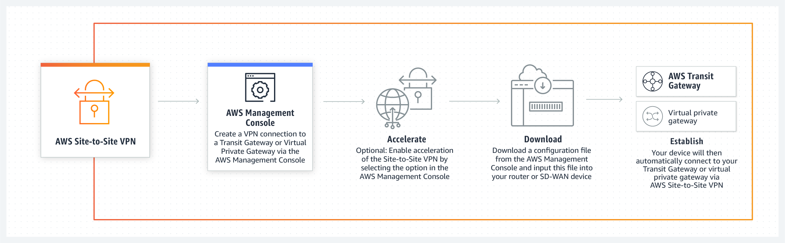
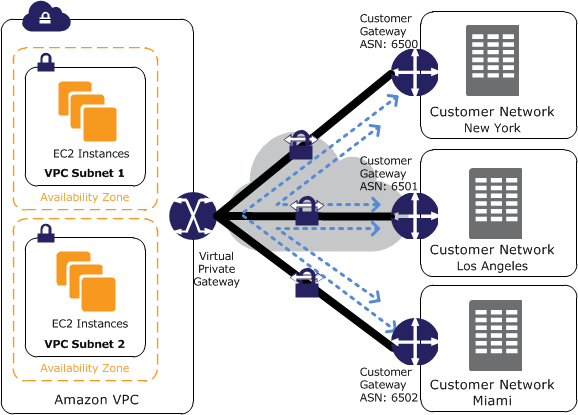

# Networking and Content Delivery on AWS

AWS provides the broadest and deepest set of [networking services](https://aws.amazon.com/products/networking/) with the **highest reliability**, most **security features**, and **highest performance** in the world. This helps ensure you can run any kind of workload you have in the cloud. 

## AWS Network Properities and Features 

Networking features in AWS:

- Most secure 
- Highest network availability 
- Consistent high performance 
- Broadest global coverage 

The AWS network properties:

- **77 Availability Zones**: multiple, physically separated, and isolated
- **100 Gbps network bandwidth**: available from many EC2 instance types
- **24 AWS Regions**: low latency, high throughput, and highly redundant
- **216 Points of Presence**: providing global coverage for your users
- **2x More Regions**: with multiple AZs than the next largest cloud provider

## AWS Networking and Content Delivery services

There are many use cases in AWS networking, and for each use case there are some services are developed for handeling each of the use cses. Use cases are such as:

1. Build a cloud network 
2. Scale your network design 
3. Secure your network traffic 
4. Build a hybrid IT network  
5. Content delivery networks
6. Build a network for microservices architectures

Would you like to see which services are used for each use case, check the [table](https://aws.amazon.com/products/networking/) below and see more details about [Networking and Content Delivery Services](https://docs.aws.amazon.com/whitepapers/latest/aws-overview/networking-services.html#amazon-vpc).

| Use Cases 	| AWS service                                                                                                                   	| Functionality                                                                                                                                                                                                                                                                                                   	|
|:---------:	|-------------------------------------------------------------------------------------------------------------------------------	|-----------------------------------------------------------------------------------------------------------------------------------------------------------------------------------------------------------------------------------------------------------------------------------------------------------------	|
|     1     	| a. [Amazon VPC](https://aws.amazon.com/vpc/?c=nt&sec=srv) b. [AWS Transit Gateway](https://aws.amazon.com/transit-gateway/?c=sc&sec=srv&whats-new-cards.sort-by=item.additionalFields.postDateTime&whats-new-cards.sort-order=desc) c. [AWS PrivateLink](https://aws.amazon.com/privatelink/?c=nt&sec=srv&privatelink-blogs.sort-by=item.additionalFields.createdDate&privatelink-blogs.sort-order=desc) d. [Amazon Route 53](https://aws.amazon.com/route53/?c=nt&sec=srv)                                           	| **a.** Define and provision a logically isolated network for your AWS resources **b.** Connect VPCs and on-premises networks through a central hub **c.** Provide private connectivity between VPCs, services, and on-premises applications **d.** Route users to Internet applications with a managed DNS service     	|
|     2     	| a. [Elastic Load Balancing](https://aws.amazon.com/elasticloadbalancing/?c=nt&sec=srv) b. [AWS Global Accelerator](https://aws.amazon.com/global-accelerator/?c=nt&sec=srv&blogs-global-accelerator.sort-by=item.additionalFields.createdDate&blogs-global-accelerator.sort-order=desc&aws-global-accelerator-wn.sort-by=item.additionalFields.postDateTime&aws-global-accelerator-wn.sort-order=desc)                                                                         	| **a.** Automatically distribute traffic across a pool of resources, such as instances, containers, IP addresses, and Lambda functions **b.** Direct traffic through the AWS Global network to improve global application performance                                                                                 	|
|     3     	| a. [AWS Shield](https://aws.amazon.com/shield/?c=nt&sec=srv&whats-new-cards.sort-by=item.additionalFields.postDateTime&whats-new-cards.sort-order=desc) b. [AWS WAF](https://aws.amazon.com/waf/?c=nt&sec=srv) c. [AWS Firewall Manager](https://aws.amazon.com/firewall-manager/?c=nt&sec=srv)                                                                        	| **a.** Safeguard applications running on AWS against DDoS attacks **b.** Protect your web applications from common web exploits **c.** Centrally configure and manage firewall rules                                                                                                                                  	|
|     4     	| a. [AWS Virtual Private Network (VPN) - Client](https://aws.amazon.com/vpn/?c=nt&sec=srv) b. [AWS Virtual Private Network (VPN) - Site to Site](https://aws.amazon.com/vpn/?c=nt&sec=srv) c. [AWS Direct Connect](https://aws.amazon.com/directconnect/?c=nt&sec=srv) 	| **a.** Connect your users to AWS or on-premises resources using a Virtual Private Network **b.** Create an encrypted connection between your network and your Amazon VPCs or AWS Transit Gateways **c.** Establish a private, dedicated connection between AWS and your datacenter, office, or colocation environment 	|
|     5     	| a. [Amazon CloudFront](https://aws.amazon.com/cloudfront/?c=nt&sec=srv)                                                                                                          	| **a.** Securely deliver data, videos, applications, and APIs to customers globally with low latency, and high transfer speeds                                                                                                                                                                                       	|
|     6     	| a. [AWS App Mesh](https://aws.amazon.com/app-mesh/?c=nt&sec=srv) b. [Amazon API Gateway](https://aws.amazon.com/api-gateway/?c=nt&sec=srv) c. [AWS Cloud Map](https://aws.amazon.com/cloud-map/?c=nt&sec=srv)                                                                  	| **a.** Provide application-level networking for containers and microservices **b.** Create, maintain, and secure APIs at any scale **c.** Discover AWS services connected to your applications                                                                                                                        	|

 

## Amazon Virtual Private Cloud (VPC)

Amazon Virtual Private Cloud (Amazon VPC) lets you provision a logically isolated section of the AWS Cloud where you can launch AWS resources in a virtual network that you define. You have complete control over your virtual networking environment, including the selection of your own IP address range, the creation of subnets, and the configuration of route tables and network gateways. You can use both IPv4 and IPv6 in your VPC for secure and easy access to resources and applications. You could create up to five non-default VPCs per AWS account per Region. (See below for information about default VPCs.)

Details on Amazon VPC can be found here: [https://aws.amazon.com/vpc](https://aws.amazon.com/vpc)

### VPC Benefits and Use Cases

**Benefits:**

1. Secure
2. Simple
3. Customizable

**Use Cases:**	

- Host a simple, public-facing website
- Host multi-tier web applications 
- Disaster recovery
- Extend your corporate network into the cloud
- Securely connect cloud applications to your datacenter
- Out-of-band and inline traffic inspection

Please check the VPC [Features](https://aws.amazon.com/vpc/details/) and [Pricing](https://aws.amazon.com/vpc/pricing/), before starting using it

### Amazon VPC concepts

Amazon VPC is the networking layer for Amazon EC2. The following are the key concepts for VPCs:

- **Virtual private cloud (VPC)** — A virtual network dedicated to your AWS account.

- **Subnet** — A range of IP addresses in your VPC.

- **Route table** — A set of rules, called routes, that are used to determine where network traffic is directed.

- **Internet gateway** — A gateway that you attach to your VPC to enable communication between resources in your VPC and the internet.

- **VPC endpoint** — Enables you to privately connect your VPC to supported AWS services and VPC endpoint services powered by PrivateLink without requiring an internet gateway, NAT device, VPN connection, or AWS Direct Connect connection. Instances in your VPC do not require public IP addresses to communicate with resources in the service. Traffic between your VPC and the other service does not leave the Amazon network. For more information, see [VPC endpoints and VPC endpoint services (AWS PrivateLink)](https://docs.aws.amazon.com/vpc/latest/userguide/endpoint-services-overview.html).

### Accessing Amazon VPC

You can create, access, and manage your VPCs using any of the following interfaces:

- **AWS Management Console** — Provides a web interface that you can use to access your VPCs.

- **AWS Command Line Interface (AWS CLI)** — Provides commands for a broad set of AWS services, including Amazon VPC, and is supported on Windows, Mac, and Linux. For more information, see [AWS Command Line Interface](https://aws.amazon.com/cli/).

- **AWS SDKs** — Provides language-specific APIs and takes care of many of the connection details, such as calculating signatures, handling request retries, and error handling. For more information, see [AWS SDKs](https://aws.amazon.com/tools/#SDKs).

- **Query API** — Provides low-level API actions that you call using HTTPS requests. Using the Query API is the most direct way to access Amazon VPC, but it requires that your application handle low-level details such as generating the hash to sign the request, and error handling. For more information, see the [Amazon EC2 API Reference](https://docs.aws.amazon.com/AWSEC2/latest/APIReference/Welcome.html).

### VPCs and subnets

A virtual private cloud (VPC) is a virtual network dedicated to your AWS account. It is logically isolated from other virtual networks in the AWS Cloud. You can launch your AWS resources, such as Amazon EC2 instances, into your VPC. You can specify an IP address range for the VPC, add subnets, associate security groups, and configure route tables.

A subnet is a range of IP addresses in your VPC. You can launch AWS resources into a specified subnet. Use a public subnet for resources that must be connected to the internet, and a private subnet for resources that won't be connected to the internet .

To protect the AWS resources in each subnet, you can use multiple layers of security, including security groups and network access control lists (ACL).

You can optionally associate an IPv6 CIDR block with your VPC, and assign IPv6 addresses to the instances in your VPC, see [https://docs.aws.amazon.com/vpc/latest/userguide/vpc-ip-addressing.html#subnet-public-ip](https://docs.aws.amazon.com/vpc/latest/userguide/vpc-ip-addressing.html#subnet-public-ip). 

## VPC Subnets

A VPC spans all the Availability Zones in the Region. After creating a VPC, you can add one or more subnets in each Availability Zone. When you create a subnet, you specify the [CIDR block](https://docs.aws.amazon.com/vpc/latest/userguide/VPC_Subnets.html#vpc-resize) for the subnet, which is a subset of the VPC [CIDR](https://tools.ietf.org/html/rfc4632) block. 

Each subnet must reside entirely:

- **within one Availability Zone**, and 
- **it can't span Availability Zones**, see the [VPC and subnet basics](https://docs.aws.amazon.com/vpc/latest/userguide/VPC_Subnets.html#vpc-subnet-basics).

The following diagram shows a new VPC with an [IPv4 CIDR](https://tools.ietf.org/html/rfc4632) block.

Security in a VPC is provided by using Security Groups and Network Access Control Groups.

### Internet Gateway

An internet gateway is a horizontally scaled, redundant, and highly available VPC component that allows communication between your VPC and the internet. 

An internet gateway serves two purposes: to provide a target in your VPC route tables for internet-routable traffic, and to perform network address translation (NAT) for instances that have been assigned public IPv4 addresses.

An internet gateway supports IPv4 and IPv6 traffic. It does not cause availability risks or bandwidth constraints on your network traffic. There's no additional charge for having an internet gateway in your account. 

The following diagram shows a VPC that has been configured with subnets in multiple Availability Zones. 1A, 2A, and 3A are instances in your VPC. An IPv6 CIDR block is associated with the VPC, and an IPv6 CIDR block is associated with subnet 1. An internet gateway enables communication over the internet, and a virtual private network (VPN) connection enables communication with your corporate network. 

### Default VPC

In each Region, AWS will provision a [default VPC](https://docs.aws.amazon.com/vpc/latest/userguide/default-vpc.html). This VPC has a /16 IPv4 CIDR address block of 172.31.0.0/16. This provides 65,536 private IPv4 addresses. In addition, there will be a /20 subnet that is created for each Availability Zone in the Region, which provides 4,096 addresses per subnet, with a few addresses reserved for AWS usage. The route table that is associated with the default VPC will have a public route, which in turn is associated with a provisioned internet gateway.

**You can modify or delete the default VPC if you want to do so.**

The most current details on the default VPC can be found here: [https://docs.aws.amazon.com/vpc/latest/userguide/default-vpc.html](https://docs.aws.amazon.com/vpc/latest/userguide/default-vpc.html)

### Default subnets

By default, a default subnet is a public subnet, because the main route table sends the subnet's traffic that is destined for the internet to the internet gateway. You can make a default subnet into a private subnet by removing the route from the destination 0.0.0.0/0 to the internet gateway. However, if you do this, no EC2 instance running in that subnet can access the internet.

Instances that you launch into a default subnet receive both a public IPv4 address and a private IPv4 address, and both public and private DNS hostnames. Instances that you launch into a nondefault subnet in a default VPC don't receive a public IPv4 address or a DNS hostname. You can change your subnet's default public IP addressing behavior. For more information, see [Modifying the public IPv4 addressing attribute for your subnet](https://docs.aws.amazon.com/vpc/latest/userguide/vpc-ip-addressing.html#subnet-public-ip).

From time to time, AWS may add a new Availability Zone to a Region. In most cases, we automatically create a new default subnet in this Availability Zone for your default VPC within a few days. However, if you made any modifications to your default VPC, we do not add a new default subnet. If you want a default subnet for the new Availability Zone, you can create one yourself. For more information, see [Creating a default subnet](https://docs.aws.amazon.com/vpc/latest/userguide/default-vpc.html#create-default-subnet) and [Default VPC and default subnets](https://docs.aws.amazon.com/vpc/latest/userguide/default-vpc.html). 

 

-------------------------------------------------------------------------------------

## Route tables

A [route table](https://docs.aws.amazon.com/vpc/latest/userguide/VPC_Route_Tables.html) contains a set of rules, called routes, that are used to determine where network traffic from your subnet or gateway is directed. 

### Route table concepts

The following are the key concepts for route tables.

- **Main route table**—The route table that automatically comes with your VPC. It controls the routing for all subnets that are not explicitly associated with any other route table.

- **Custom route table**—A route table that you create for your VPC.

- **Edge association**—A route table that you use to route inbound VPC traffic to an appliance. You associate a route table with the internet gateway or virtual private gateway, and specify the network interface of your appliance as the target for VPC traffic.

- **Route table association**—The association between a route table and a subnet, internet gateway, or virtual private gateway.

- **Subnet route table**—A route table that's associated with a subnet.

- **Gateway route table**—A route table that's associated with an internet gateway or virtual private gateway.

- **Local gateway route table**—A route table that's associated with an Outposts local gateway. For information about local gateways, see Local Gateways in the AWS Outposts User Guide.

- **Destination**—The range of IP addresses where you want traffic to go (destination CIDR). For example, an external corporate network with a `172.16.0.0/12` CIDR.

- **Propagation**—Route propagation allows a virtual private gateway to automatically propagate routes to the route tables. This means that you don't need to manually enter VPN routes to your route tables. For more information about VPN routing options, see Site-to-Site VPN routing options in the Site-to-Site VPN User Guide.

- **Target**—The gateway, network interface, or connection through which to send the destination traffic; for example, an internet gateway.

- **Local route**—A default route for communication within the VPC.

For example routing options, see [Example routing options](https://docs.aws.amazon.com/vpc/latest/userguide/route-table-options.html).

### How route tables work

Your VPC has an implicit router, and you use route tables to control where network traffic is directed. Each subnet in your VPC must be associated with a route table, which controls the routing for the subnet (subnet route table). You can explicitly associate a subnet with a particular route table. Otherwise, the subnet is implicitly associated with the main route table. A subnet can only be associated with one route table at a time, but you can associate multiple subnets with the same subnet route table.

You can optionally associate a route table with an internet gateway or a virtual private gateway (gateway route table). This enables you to specify routing rules for inbound traffic that enters your VPC through the gateway. For more information, see [Gateway route tables](https://docs.aws.amazon.com/vpc/latest/userguide/VPC_Route_Tables.html#gateway-route-table).

#### Routes

Each route in a table specifies a destination and a target. For example, to enable your subnet to access the internet through an internet gateway, add the following route to your subnet route table.

|Destination |	Target |
-------------|------------|
|0.0.0.0/0 |	igw-12345678901234567|

The destination for the route is 0.0.0.0/0, which represents all IPv4 addresses. The target is the internet gateway that's attached to your VPC. 

#### Main route table

When you create a VPC, it automatically has a main route table. The main route table controls the routing for all subnets that are not explicitly associated with any other route table. On the Route Tables page in the Amazon VPC console, you can view the main route table for a VPC by looking for Yes in the Main column.

By default, when you create a nondefault VPC, the main route table contains only a local route. When you use the VPC wizard in the console to create a nondefault VPC with a NAT gateway or virtual private gateway, the wizard automatically adds routes to the main route table for those gateways.

You can add, remove, and modify routes in the main route table. You cannot create a more specific route than the local route. You cannot delete the main route table, but you can replace the main route table with a custom subnet route table that you've created. You cannot set a gateway route table as the main route table.

You can explicitly associate a subnet with the main route table, even if it's already implicitly associated. You might want to do that if you change which table is the main route table. When you change which table is the main route table, it also changes the default for additional new subnets, or for any subnets that are not explicitly associated with any other route table. For more information, see [Replacing the main route table](https://docs.aws.amazon.com/vpc/latest/userguide/WorkWithRouteTables.html#Route_Replacing_Main_Table). 

#### Custom route tables

By default, a custom route table is empty and you add routes as needed. When you use the VPC wizard in the console to create a VPC with an internet gateway, the wizard creates a custom route table and adds a route to the internet gateway. One way to protect your VPC is to leave the main route table in its original default state. Then, explicitly associate each new subnet that you create with one of the custom route tables you've created. This ensures that you explicitly control how each subnet routes traffic.

You can add, remove, and modify routes in a custom route table. You can delete a custom route table only if it has no associations. 

### Route priority

We use the most specific route in your route table that matches the traffic to determine how to route the traffic (longest prefix match).

Routes to IPv4 and IPv6 addresses or CIDR blocks are independent of each other. We use the most specific route that matches either IPv4 traffic or IPv6 traffic to determine how to route the traffic.

For example, the following subnet route table has a route for IPv4 internet traffic (`0.0.0.0/0`) that points to an internet gateway, and a route for `172.31.0.0/16` IPv4 traffic that points to a peering connection (`pcx-11223344556677889`). Any traffic from the subnet that's destined for the `172.31.0.0/16` IP address range uses the peering connection, because this route is more specific than the route for internet gateway. Any traffic destined for a target within the VPC (`10.0.0.0/16`) is covered by the Local route, and therefore is routed within the VPC. All other traffic from the subnet uses the internet gateway. 

|Destination |	Target|
|------------|--------|
|10.0.0.0/16 |	Local|
|172.31.0.0/16 |	pcx-11223344556677889|
|0.0.0.0/0 |	igw-12345678901234567|

 
Still more and more details about routes and routing tables, see:

- [Example routing options](https://docs.aws.amazon.com/vpc/latest/userguide/route-table-options.html)
- [Working with route tables](https://docs.aws.amazon.com/vpc/latest/userguide/WorkWithRouteTables.html)

 

-------------------------------------------------------------------------------------

## AWS Direct Connect

AWS Direct Connect is a cloud service solution that makes it easy to establish a dedicated network connection from your premises to AWS. Using AWS Direct Connect, you can establish private connectivity between **AWS** and **your datacenter, office, or colocation environment**, which in many cases can reduce your network costs, increase bandwidth throughput, and provide a more consistent network experience than Internet-based connections.

AWS Direct Connect lets you establish a dedicated network connection between your network and one of the AWS Direct Connect locations. Using industry standard 802.1q VLANs, this dedicated connection can be partitioned into multiple virtual interfaces. This allows you to use the same connection to access public resources such as objects stored in Amazon S3 using public IP address space, and private resources such as Amazon EC2 instances running within an [Amazon Virtual Private Cloud (VPC)](https://aws.amazon.com/vpc/) using private IP space, while maintaining network separation between the public and private environments. Virtual interfaces can be reconfigured at any time to meet your changing needs.

### Amazon Direct Connect Use Cases and Benefits

** When to use AWS Direct Connect **

With AWS Direct Connect, you can connect to all your AWS resources in an AWS Region, transfer your business critical data directly from your datacenter, office, or colocation environment into and from AWS, bypassing your Internet service provider and removing network congestion. Further, AWS Direct Connect’s simple pay as-you-go pricing and no minimum commitment means you pay only for the network ports you use and the data you transfer out of the AWS Region over the AWS Direct Connect connection, which can greatly reduce your networking costs.

There are several use cases for which AWS Direct Connect is desirable, including:

1. Working with Large Data Sets
2. Real-time Data Feeds
3. Hybrid Environments

 **AWS Direct Connect Benefits**

- Reduces Your Bandwidth Costs
- Consistent Network Performance
- Compatible with all AWS Services
- Private Connectivity to your Amazon VPC
- Elastic
- Simple

For more details, read [AWS Direct Connect features](https://aws.amazon.com/directconnect/features/?nc=sn&loc=2) and [AWS Direct Connect pricing](https://aws.amazon.com/directconnect/pricing/?nc=sn&loc=3).

### Virtual private gateway

You can use an AWS Direct Connect gateway to connect your AWS Direct Connect connection over a private virtual interface to one or more VPCs in any account that are located in the same or different Regions. You associate a Direct Connect gateway with the virtual private gateway for the VPC. Then, you create a private virtual interface for your AWS Direct Connect connection to the Direct Connect gateway. You can attach multiple private virtual interfaces to your Direct Connect gateway. 

Consider the following while using the [VPG](https://docs.aws.amazon.com/directconnect/latest/UserGuide/virtualgateways.html):

- There are limits for creating and using Direct Connect gateways.
- The VPCs to which you connect through a Direct Connect gateway cannot have overlapping CIDR blocks. If you add an IPv4 CIDR block to a VPC that's associated with a Direct Connect gateway, ensure that the CIDR block does not overlap with an existing CIDR block for any other associated VPC. For more information, see Adding IPv4 CIDR Blocks to a VPC in the Amazon VPC User Guide. 
- You cannot create a public virtual interface to a Direct Connect gateway.
- A Direct Connect gateway supports communication between attached private virtual interfaces and associated virtual private gateways only. The following traffic flows are not supported:

	- Direct communication between the VPCs that are associated with a single Direct Connect gateway. This includes traffic from one VPC to another by using a hairpin through an on-premises network through a single Direct Connect gateway. 
	- Direct communication between the virtual interfaces that are attached to a single Direct Connect gateway. 
	- Direct communication between the virtual interfaces that are attached to a single Direct Connect gateway and a VPN connection on a virtual private gateway that's associated with the same Direct Connect gateway. 

- You cannot associate a virtual private gateway with more than one Direct Connect gateway and you cannot attach a private virtual interface to more than one Direct Connect gateway. 
- A virtual private gateway that you associate with a Direct Connect gateway must be attached to a VPC. 
- A virtual private gateway association proposal expires 7 days after it is created. 
- An accepted virtual private gateway proposal, or a deleted virtual private gateway proposal remains visible for 3 days. 

To connect your AWS Direct Connect connection to a VPC in the same Region only, you can create a Direct Connect gateway. Or, you can create a private virtual interface and attach it to the virtual private gateway for the VPC. For more information, see [Creating a private virtual interface](https://docs.aws.amazon.com/directconnect/latest/UserGuide/create-vif.html#create-private-vif) and [VPN CloudHub](https://docs.aws.amazon.com/vpn/latest/s2svpn/VPN_CloudHub.html).

To use your AWS Direct Connect connection with a VPC in another account, you can create a hosted private virtual interface for that account. When the owner of the other account accepts the hosted virtual interface, they can choose to attach it either to a virtual private gateway or to a Direct Connect gateway in their account. For more information, see [AWS Direct Connect virtual interfaces](https://docs.aws.amazon.com/directconnect/latest/UserGuide/WorkingWithVirtualInterfaces.html). 

Please see, how to:

- [Creating a virtual private gateway](https://docs.aws.amazon.com/directconnect/latest/UserGuide/virtualgateways.html#create-virtual-private-gateway)
- [Associating and disassociating virtual private gateways](https://docs.aws.amazon.com/directconnect/latest/UserGuide/virtualgateways.html#associate-vgw-with-direct-connect-gateway)
- [Creating a private virtual interface to the Direct Connect gateway ](https://docs.aws.amazon.com/directconnect/latest/UserGuide/virtualgateways.html#create-private-vif-for-gateway)
- [Associating a virtual private gateway across accounts](https://docs.aws.amazon.com/directconnect/latest/UserGuide/multi-account-associate-vgw.html)

### AWS VPN

[AWS Virtual Private Network](https://aws.amazon.com/vpn/) solutions establish secure connections between your on-premises networks, remote offices, client devices, and the AWS global network. AWS VPN is comprised of two services: AWS Site-to-Site VPN and AWS Client VPN. Together, they deliver a highly-available, managed, and elastic cloud VPN solution to protect your network traffic.

AWS Site-to-Site VPN creates encrypted tunnels between your network and your Amazon Virtual Private Clouds or AWS Transit Gateways. For managing remote access, AWS Client VPN connects your users to AWS or on-premises resources using a VPN software client.

Two flavors of the AWS VPN:

1. AWS Client VPN
2. AWS Site-to-Site VPN

#### AWS Client VPN

AWS Client VPN is a fully-managed, elastic VPN service that automatically scales up or down based on user demand. Because it is a cloud VPN solution, you don’t need to install and manage hardware or software-based solutions, or try to estimate how many remote users to support at one time. 

**Benefits**

- Fully managed
- Advanced authentication
- Elastic
- Remote access

**Use cases**

- Quickly scale remote access
- Easily deploy and remove VPN access for temporary workers
- Easily access applications in the cloud or on premises

**How it works**

#### AWS Site-to-Site VPN

AWS Site-to-Site VPN creates a secure connection between your data center or branch office and your AWS cloud resources. For globally distributed applications, the Accelerated Site-to-Site VPN option provides even greater performance by working with AWS Global Accelerator. 

**Benefits**

- Highly available
- Secure
- Robust monitoring
- Accelerate Applicationss

**Use cases**

- Extend your corporate network into the cloud
- Secure communication between remote locations

**How it works**

#### VPN CloudHub

If you have multiple AWS Site-to-Site VPN connections, you can provide secure communication between sites using the AWS VPN CloudHub. This enables your remote sites to communicate with each other, and not just with the VPC. The VPN CloudHub operates on a simple hub-and-spoke model that you can use with or without a VPC. This design is suitable if you have multiple branch offices and existing internet connections and would like to implement a convenient, potentially low-cost hub-and-spoke model for primary or backup connectivity between these remote offices.

The sites must not have overlapping IP ranges.

The following diagram shows the VPN CloudHub architecture, with blue dashed lines indicating network traffic between remote sites being routed over their Site-to-Site VPN connections.

See, [Providing secure communication between sites using VPN CloudHub](https://docs.aws.amazon.com/vpn/latest/s2svpn/VPN_CloudHub.html) for more details about how to configure the previous topology.