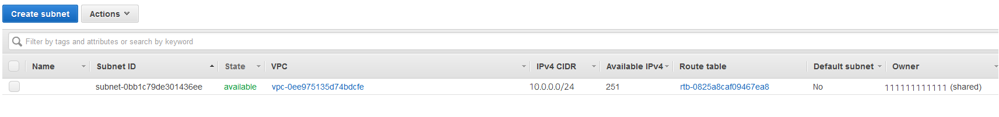

# Getting started with Amazon VPCs

## Different VPC Topology Configurations

 Two different topoplogies for the AWS VPCs, such as:

 - Accessing the internet through the VPC
 - Accessing a corporate or home network (on-premises Datacenter) through the VPC

### Accessing the internet

You control how the instances that you launch into a VPC access resources outside the VPC.

Your default VPC includes an internet gateway, and each default subnet is a public subnet. Each instance that you launch into a default subnet has a private IPv4 address and a public IPv4 address. These instances can communicate with the internet through the internet gateway. An internet gateway enables your instances to connect to the internet through the Amazon EC2 network edge. 

By default, each instance that you launch into a nondefault subnet has a private IPv4 address, but no public IPv4 address, unless you specifically assign one at launch, or you modify the subnet's public IP address attribute. These instances can communicate with each other, but can't access the internet.

You can enable internet access for an instance launched into a nondefault subnet by attaching an internet gateway to its VPC (if its VPC is not a default VPC) and associating an Elastic IP address with the instance. 

Alternatively, to allow an instance in your VPC to initiate outbound connections to the internet but prevent unsolicited inbound connections from the internet, you can use a network address translation (NAT) device for IPv4 traffic. NAT maps multiple private IPv4 addresses to a single public IPv4 address. A NAT device has an Elastic IP address and is connected to the internet through an internet gateway. You can connect an instance in a private subnet to the internet through the NAT device, which routes traffic from the instance to the internet gateway, and routes any responses to the instance.

If you associate an IPv6 CIDR block with your VPC and assign IPv6 addresses to your instances, instances can connect to the internet over IPv6 through an internet gateway. Alternatively, instances can initiate outbound connections to the internet over IPv6 using an egress-only internet gateway. IPv6 traffic is separate from IPv4 traffic; your route tables must include separate routes for IPv6 traffic. 

### Accessing a corporate or home network

You can optionally connect your VPC to your own corporate data center using an IPsec AWS Site-to-Site VPN connection, making the AWS Cloud an extension of your data center.

A Site-to-Site VPN connection consists of two VPN tunnels between a virtual private gateway or transit gateway on the AWS side, and a customer gateway device located in your data center. A customer gateway device is a physical device or software appliance that you configure on your side of the Site-to-Site VPN connection. 

## Amazon VPC console wizard configurations

You can use the Amazon VPC Console wizard to create one of the following nondefault VPC configurations:

- [VPC with a single public subnet](https://docs.aws.amazon.com/vpc/latest/userguide/VPC_Scenario1.html)
- [VPC with public and private subnets (NAT)](https://docs.aws.amazon.com/vpc/latest/userguide/VPC_Scenario2.html)
- [VPC with public and private subnets and AWS Site-to-Site VPN access](https://docs.aws.amazon.com/vpc/latest/userguide/VPC_Scenario3.html)
- [VPC with a private subnet only and AWS Site-to-Site VPN access](https://docs.aws.amazon.com/vpc/latest/userguide/VPC_Scenario4.html)

## Working with VPCs and subnets

The following procedures are for manually creating a VPC and subnets. You also have to manually add gateways and routing tables. Alternatively, you can use the Amazon VPC wizard to create a VPC plus its subnets, gateways, and routing tables in one step. For more information, see [Examples for VPC](https://docs.aws.amazon.com/vpc/latest/userguide/VPC_Scenarios.html) and [How to work with VPCs and Subnets](https://docs.aws.amazon.com/vpc/latest/userguide/working-with-vpcs.html). 

- [Creating a VPC](https://docs.aws.amazon.com/vpc/latest/userguide/working-with-vpcs.html#Create-VPC)
- [Creating a subnet in your VPC](https://docs.aws.amazon.com/vpc/latest/userguide/working-with-vpcs.html#AddaSubnet)
- [Associating a secondary IPv4 CIDR block with your VPC](https://docs.aws.amazon.com/vpc/latest/userguide/working-with-vpcs.html#add-ipv4-cidr)
- [Associating an IPv6 CIDR block with your VPC](https://docs.aws.amazon.com/vpc/latest/userguide/working-with-vpcs.html#vpc-associate-ipv6-cidr)
- [Associating an IPv6 CIDR block with your subnet](https://docs.aws.amazon.com/vpc/latest/userguide/working-with-vpcs.html#subnet-associate-ipv6-cidr)
- [Launching an instance into your subnet](https://docs.aws.amazon.com/vpc/latest/userguide/working-with-vpcs.html#VPC_Launch_Instance)
- [Deleting your subnet](https://docs.aws.amazon.com/vpc/latest/userguide/working-with-vpcs.html#subnet-deleting)
- [Disassociating an IPv4 CIDR block from your VPC](https://docs.aws.amazon.com/vpc/latest/userguide/working-with-vpcs.html#remove-ipv4-cidr)
- [Disassociating an IPv6 CIDR block from your VPC or subnet](https://docs.aws.amazon.com/vpc/latest/userguide/working-with-vpcs.html#vpc-subnet-disassociate-ipv6)
- [Deleting your VPC](https://docs.aws.amazon.com/vpc/latest/userguide/working-with-vpcs.html#VPC_Deleting)

## Adding an internet gateway to your VPC

The following describes how to manually [create a public subnet and attach an internet gateway](https://docs.aws.amazon.com/vpc/latest/userguide/VPC_Internet_Gateway.html) to your VPC to support internet access.

- [Creating a subnet](https://docs.aws.amazon.com/vpc/latest/userguide/VPC_Internet_Gateway.html#Add_IGW_Create_Subnet)
- [Creating and attaching an internet gateway](https://docs.aws.amazon.com/vpc/latest/userguide/VPC_Internet_Gateway.html#Add_IGW_Attach_Gateway)
- [Creating a custom route table](https://docs.aws.amazon.com/vpc/latest/userguide/VPC_Internet_Gateway.html#Add_IGW_Routing)
- [Creating a security group for internet access](https://docs.aws.amazon.com/vpc/latest/userguide/VPC_Internet_Gateway.html#Add_IG_Security_Groups)
- [Adding Elastic IP addresses](https://docs.aws.amazon.com/vpc/latest/userguide/VPC_Internet_Gateway.html#Add_IG_EIPs)
- [Detaching an internet gateway from your VPC](https://docs.aws.amazon.com/vpc/latest/userguide/VPC_Internet_Gateway.html#detach-igw)
- [Deleting an internet gateway](https://docs.aws.amazon.com/vpc/latest/userguide/VPC_Internet_Gateway.html#delete-igw)
- [API and command overview](https://docs.aws.amazon.com/vpc/latest/userguide/VPC_Internet_Gateway.html#api_cli_overview)

### Adding other Gateways to your VPC

There are other types of gateways, you may need during the planning of your VPCs in AWS, such as:

- [Virtual private gateways](https://docs.aws.amazon.com/directconnect/latest/UserGuide/virtualgateways.html#create-virtual-private-gateway)
- [Egress-only internet gateways](https://docs.aws.amazon.com/vpc/latest/userguide/egress-only-internet-gateway.html)
- [Carrier gateways](https://docs.aws.amazon.com/vpc/latest/userguide/Carrier_Gateway.html)

### Working with route tables

The following tasks show you how to work with route tables.

		/!\ Note

		When you use the VPC wizard in the console to create a VPC with a gateway, the wizard automatically updates the route

		tables to use the gateway. If you are using the command line tools or API to set up your VPC, you must update the route

		tables yourself.

- [Determining which route table a subnet is associated with](https://docs.aws.amazon.com/vpc/latest/userguide/WorkWithRouteTables.html#SubnetRouteTables)
- [Determining which subnets and or gateways are explicitly associated with a table](https://docs.aws.amazon.com/vpc/latest/userguide/WorkWithRouteTables.html#Route_Which_Associations)
- [Creating a custom route table](https://docs.aws.amazon.com/vpc/latest/userguide/WorkWithRouteTables.html#CustomRouteTable)
- [Adding and removing routes from a route table](https://docs.aws.amazon.com/vpc/latest/userguide/WorkWithRouteTables.html#AddRemoveRoutes)
- [Deleting a route table](https://docs.aws.amazon.com/vpc/latest/userguide/WorkWithRouteTables.html#DeleteRouteTable)
- [and more ...](https://docs.aws.amazon.com/vpc/latest/userguide/WorkWithRouteTables.html#DeleteRouteTable)

 

-----------------------------------------------------------------

## Working with shared VPCs

VPC sharing allows multiple AWS accounts to create their application resources, such as Amazon EC2 instances, Amazon Relational Database Service (RDS) databases, Amazon Redshift clusters, and AWS Lambda functions, into shared, centrally-managed Amazon Virtual Private Clouds (VPCs). In this model, the account that owns the VPC (owner) shares one or more subnets with other accounts (participants) that belong to the same organization from AWS Organizations. After a subnet is shared, the participants can view, create, modify, and delete their application resources in the subnets shared with them. Participants cannot view, modify, or delete resources that belong to other participants or the VPC owner.

You can share Amazon VPCs to leverage the implicit routing within a VPC for applications that require a high degree of interconnectivity and are within the same trust boundaries. This reduces the number of VPCs that you create and manage, while using separate accounts for billing and access control. You can simplify network topologies by interconnecting shared Amazon VPCs using connectivity features, such as AWS PrivateLink, AWS Transit Gateway, and Amazon VPC peering. For more information about VPC sharing benefits, see [VPC sharing: A new approach to multiple accounts and VPC management](https://aws.amazon.com/blogs/networking-and-content-delivery/vpc-sharing-a-new-approach-to-multiple-accounts-and-vpc-management/).

### Sharing the VPCs

The following will help you to share your VPC with your other accounts:

- [Shared VPCs prerequisites](https://docs.aws.amazon.com/vpc/latest/userguide/vpc-sharing.html#vpc-share-prerequisites)
- [Sharing a subnet](https://docs.aws.amazon.com/vpc/latest/userguide/vpc-sharing.html#vpc-sharing-share-subnet)
- [Unsharing a shared subnet](https://docs.aws.amazon.com/vpc/latest/userguide/vpc-sharing.html#vpc-sharing-stop-share-subnet)
- [Identifying the owner of a shared subnet](https://docs.aws.amazon.com/vpc/latest/userguide/vpc-sharing.html#vpc-sharing-view-owner)
- [And more ...](https://docs.aws.amazon.com/vpc/latest/userguide/vpc-sharing.html)

### Example: Sharing public subnets and private subnets

Consider this scenario where you want an account to be responsible for the infrastructure, including subnets, route tables, gateways, and CIDR ranges and other accounts that are in the same AWS Organization to use the subnets. A VPC owner (Account A) creates the routing infrastructure, including the VPCs, subnets, route tables, gateways, and network ACLs. Account D wants to create public facing applications. Account B and Account C want to create private applications that do not need to connect to the internet and should reside in private subnets. Account A can use AWS Resource Access Manager to create a Resource Share for the subnets and then share the subnets. Account A shares the public subnet with Account D and the private subnet with Account B, and Account C. Account B, Account C, and Account D can create resources in the subnets. Each account can only see the subnets that are shared with them, for example, Account D can only see the public subnet. Each of the accounts can control their resources, including instances, and security groups.

Account A manages the IP infrastructure, including the route tables for the public subnets, and the private subnets. There is no additional configuration required for shared subnets, so the route tables are the same as unshared subnet route tables. 

Account A (Account ID 111111111111) shares the public subnet with Account D (444444444444). Account D sees the following subnet, and the Owner column provides two indicators that the subnet is shared.

- The Account ID is the VPC owner (111111111111) and is different from Account D's ID (444444444444).

- The word "shared" appears beside the owner account ID.

 

-----------------------------------------------------------------

## Security best practices for your VPC

The following best practices are general guidelines and don’t represent a complete security solution. Because these best practices might not be appropriate or sufficient for your environment, treat them as helpful considerations rather than prescriptions.

The following are general best practices:

- Use multiple Availability Zone deployments so you have high availability.

- Use security groups and network ACLs. For more information, see [Security groups for your VPC](https://docs.aws.amazon.com/vpc/latest/userguide/VPC_SecurityGroups.html) and [Network ACLs](https://docs.aws.amazon.com/vpc/latest/userguide/vpc-network-acls.html).

- Use IAM policies to control access.

- Use Amazon CloudWatch to monitor your VPC components and VPN connections.

- Use flow logs to capture information about IP traffic going to and from network interfaces in your VPC. For more information, see [VPC Flow Logs](https://docs.aws.amazon.com/vpc/latest/userguide/flow-logs.html).

## Additional resources

- Manage access to AWS resources and APIs using identity federation, IAM users, and IAM roles. Establish credential management policies and procedures for creating, distributing, rotating, and revoking AWS access credentials. For more information, see [IAM best practices](https://docs.aws.amazon.com/IAM/latest/UserGuide/best-practices.html) in the IAM User Guide.

- For answers to frequently asked questions for VPC security, see [Amazon VPC FAQs](https://aws.amazon.com/vpc/faqs/). 