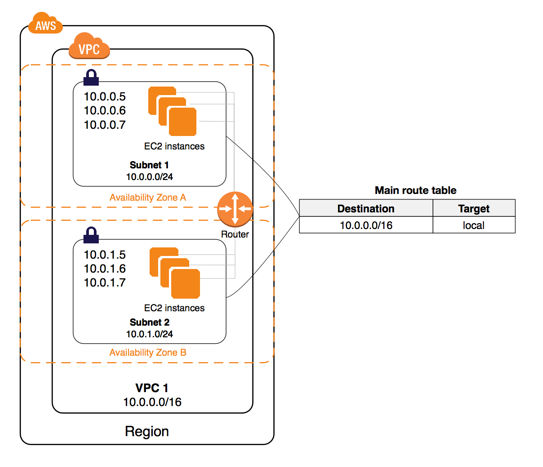

# Getting started with Amazon VPCs

## Different VPC Topology Configurations

 Two different topoplogies for the AWS VPCs, such as:

 - Accessing the internet through the VPC
 - Accessing a corporate or home network (on-premises Datacenter) through the VPC

### Accessing the internet

You control how the instances that you launch into a VPC access resources outside the VPC.

Your default VPC includes an internet gateway, and each default subnet is a public subnet. Each instance that you launch into a default subnet has a private IPv4 address and a public IPv4 address. These instances can communicate with the internet through the internet gateway. An internet gateway enables your instances to connect to the internet through the Amazon EC2 network edge. 

By default, each instance that you launch into a nondefault subnet has a private IPv4 address, but no public IPv4 address, unless you specifically assign one at launch, or you modify the subnet's public IP address attribute. These instances can communicate with each other, but can't access the internet.

You can enable internet access for an instance launched into a nondefault subnet by attaching an internet gateway to its VPC (if its VPC is not a default VPC) and associating an Elastic IP address with the instance. 

Alternatively, to allow an instance in your VPC to initiate outbound connections to the internet but prevent unsolicited inbound connections from the internet, you can use a network address translation (NAT) device for IPv4 traffic. NAT maps multiple private IPv4 addresses to a single public IPv4 address. A NAT device has an Elastic IP address and is connected to the internet through an internet gateway. You can connect an instance in a private subnet to the internet through the NAT device, which routes traffic from the instance to the internet gateway, and routes any responses to the instance.

If you associate an IPv6 CIDR block with your VPC and assign IPv6 addresses to your instances, instances can connect to the internet over IPv6 through an internet gateway. Alternatively, instances can initiate outbound connections to the internet over IPv6 using an egress-only internet gateway. IPv6 traffic is separate from IPv4 traffic; your route tables must include separate routes for IPv6 traffic. 

### Accessing a corporate or home network

You can optionally connect your VPC to your own corporate data center using an IPsec AWS Site-to-Site VPN connection, making the AWS Cloud an extension of your data center.

A Site-to-Site VPN connection consists of two VPN tunnels between a virtual private gateway or transit gateway on the AWS side, and a customer gateway device located in your data center. A customer gateway device is a physical device or software appliance that you configure on your side of the Site-to-Site VPN connection. 

## Amazon VPC console wizard configurations

You can use the Amazon VPC Console wizard to create one of the following nondefault VPC configurations:

- [VPC with a single public subnet](https://docs.aws.amazon.com/vpc/latest/userguide/VPC_Scenario1.html)
- [VPC with public and private subnets (NAT)](https://docs.aws.amazon.com/vpc/latest/userguide/VPC_Scenario2.html)
- [VPC with public and private subnets and AWS Site-to-Site VPN access](https://docs.aws.amazon.com/vpc/latest/userguide/VPC_Scenario3.html)
- [VPC with a private subnet only and AWS Site-to-Site VPN access](https://docs.aws.amazon.com/vpc/latest/userguide/VPC_Scenario4.html)

## Working with VPCs and subnets

The following procedures are for manually creating a VPC and subnets. You also have to manually add gateways and routing tables. Alternatively, you can use the Amazon VPC wizard to create a VPC plus its subnets, gateways, and routing tables in one step. For more information, see [Examples for VPC](https://docs.aws.amazon.com/vpc/latest/userguide/VPC_Scenarios.html) and [How to work with VPCs and Subnets](https://docs.aws.amazon.com/vpc/latest/userguide/working-with-vpcs.html). 

- [Creating a VPC](https://docs.aws.amazon.com/vpc/latest/userguide/working-with-vpcs.html#Create-VPC)
- [Creating a subnet in your VPC](https://docs.aws.amazon.com/vpc/latest/userguide/working-with-vpcs.html#AddaSubnet)
- [Associating a secondary IPv4 CIDR block with your VPC](https://docs.aws.amazon.com/vpc/latest/userguide/working-with-vpcs.html#add-ipv4-cidr)
- [Associating an IPv6 CIDR block with your VPC](https://docs.aws.amazon.com/vpc/latest/userguide/working-with-vpcs.html#vpc-associate-ipv6-cidr)
- [Associating an IPv6 CIDR block with your subnet](https://docs.aws.amazon.com/vpc/latest/userguide/working-with-vpcs.html#subnet-associate-ipv6-cidr)
- [Launching an instance into your subnet](https://docs.aws.amazon.com/vpc/latest/userguide/working-with-vpcs.html#VPC_Launch_Instance)
- [Deleting your subnet](https://docs.aws.amazon.com/vpc/latest/userguide/working-with-vpcs.html#subnet-deleting)
- [Disassociating an IPv4 CIDR block from your VPC](https://docs.aws.amazon.com/vpc/latest/userguide/working-with-vpcs.html#remove-ipv4-cidr)
- [Disassociating an IPv6 CIDR block from your VPC or subnet](https://docs.aws.amazon.com/vpc/latest/userguide/working-with-vpcs.html#vpc-subnet-disassociate-ipv6)
- [Deleting your VPC](https://docs.aws.amazon.com/vpc/latest/userguide/working-with-vpcs.html#VPC_Deleting)

## Adding an internet gateway to your VPC

The following describes how to manually [create a public subnet and attach an internet gateway](https://docs.aws.amazon.com/vpc/latest/userguide/VPC_Internet_Gateway.html) to your VPC to support internet access.

- [Creating a subnet](https://docs.aws.amazon.com/vpc/latest/userguide/VPC_Internet_Gateway.html#Add_IGW_Create_Subnet)
- [Creating and attaching an internet gateway](https://docs.aws.amazon.com/vpc/latest/userguide/VPC_Internet_Gateway.html#Add_IGW_Attach_Gateway)
- [Creating a custom route table](https://docs.aws.amazon.com/vpc/latest/userguide/VPC_Internet_Gateway.html#Add_IGW_Routing)
- [Creating a security group for internet access](https://docs.aws.amazon.com/vpc/latest/userguide/VPC_Internet_Gateway.html#Add_IG_Security_Groups)
- [Adding Elastic IP addresses](https://docs.aws.amazon.com/vpc/latest/userguide/VPC_Internet_Gateway.html#Add_IG_EIPs)
- [Detaching an internet gateway from your VPC](https://docs.aws.amazon.com/vpc/latest/userguide/VPC_Internet_Gateway.html#detach-igw)
- [Deleting an internet gateway](https://docs.aws.amazon.com/vpc/latest/userguide/VPC_Internet_Gateway.html#delete-igw)
- [API and command overview](https://docs.aws.amazon.com/vpc/latest/userguide/VPC_Internet_Gateway.html#api_cli_overview)

